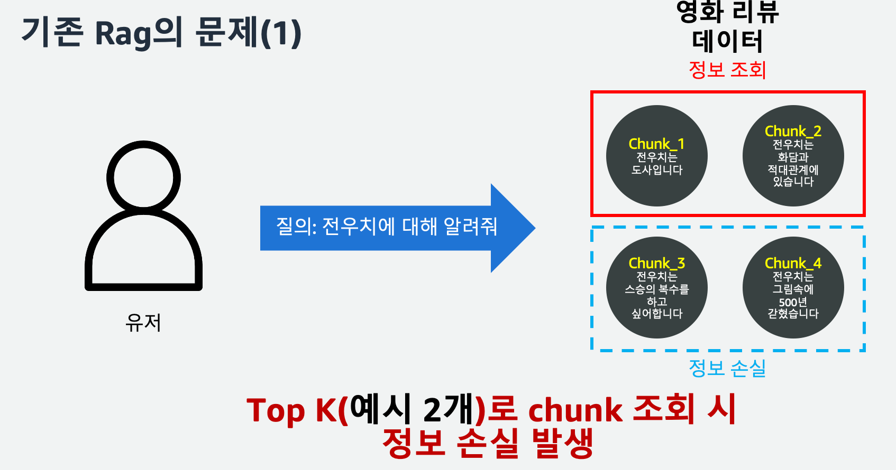
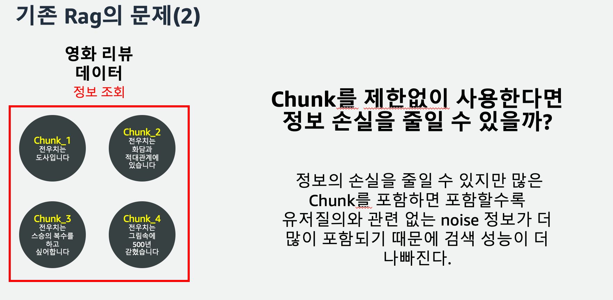
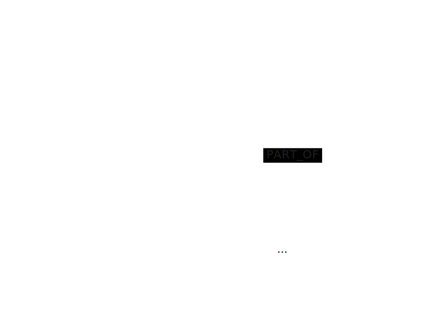
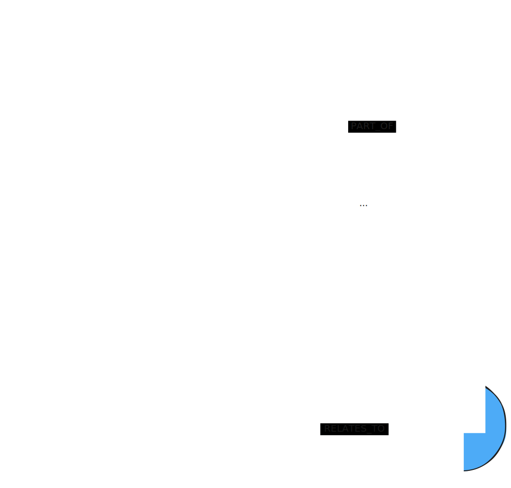
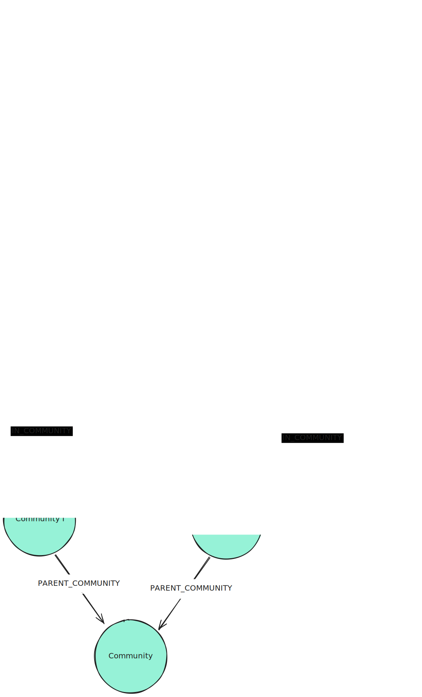

# 1. GraphRAG 개요

## 1.1 GraphRAG란?

**GraphRAG (Graph-based Retrieval-Augmented Generation)** 은 Knowledge Graph와 RAG를 결합한 기술입니다.

### 기존 RAG의 한계





| 구분 | 기존 Vector RAG | GraphRAG |
|------|----------------|----------|
| 검색 방식 | 벡터 유사도 기반 chunk 검색 | 그래프 구조 탐색 + 벡터 검색 |
| 컨텍스트 | 독립적인 텍스트 조각 | 엔티티 간 관계가 보존된 구조화된 지식 |
| Multi-hop 질의 | 어려움 (여러 chunk에 분산된 정보) | 그래프 탐색으로 자연스럽게 지원 |
| 할루시네이션 | 상대적으로 높음 | 구조화된 근거로 감소 |
| 출처 추적 | chunk 단위 | 문서 → chunk → 엔티티 → 관계까지 추적 |

### GraphRAG의 핵심 아이디어

```
[문서] → [텍스트 추출] → [엔티티/관계 추출] → [Knowledge Graph 구축]
                                                        ↓
[사용자 질문] → [벡터 검색 + 그래프 탐색] → [관련 컨텍스트 조합] → [LLM 응답 생성]
```

기존 RAG가 "비슷한 텍스트 조각"을 찾는 데 반해, GraphRAG는 **엔티티 간의 관계를 따라가며** 더 풍부하고 정확한 컨텍스트를 제공합니다.

> 벡터 유사도 검색만으로는 찾을 수 없는 정보 — **질문과 의미적으로 유사하지 않지만, 답변에 필요한 정보** — 를 그래프의 관계를 통해 찾아낼 수 있습니다.

---


## 2. Graph Pattern

### 2.1 RDF vs Property Graph

그래프 데이터베이스에는 크게 **두 가지 모델**이 있습니다.

| 구분 | RDF (Resource Description Framework) | Property Graph |
|------|---------------------------------------|----------------|
| **데이터 모델** | 트리플 (Subject-Predicate-Object) | 노드와 엣지에 속성(Property)을 가진 그래프 |
| **쿼리 언어** | SPARQL | Cypher (Neo4j), openCypher, Gremlin |
| **표준** | W3C 국제 표준 | 사실상 표준 (de facto) |
| **스키마** | 온톨로지 기반 (OWL, RDFS) | 스키마리스 또는 유연한 스키마 |
| **강점** | 데이터 통합, 시맨틱 웹, 추론 | 직관적, 높은 성능, 실용적 |
| **약점** | 학습 곡선 높음, 복잡한 쿼리 | 표준화 부족 (각 벤더 차이) |
| **대표 DB** | Amazon Neptune, Apache Jena, Blazegraph | Neo4j, Amazon Neptune, FalkorDB |
| **사용 사례** | 연구 데이터 관리, 데이터 통합, 의료 온톨로지 | 소셜 네트워크, 추천, 사기 탐지, GraphRAG |

> **Amazon Neptune**은 RDF와 Property Graph를 모두 지원하는 유일한 AWS 관리형 그래프 데이터베이스입니다.
> SPARQL(RDF)과 openCypher(Property Graph) 양쪽 쿼리 언어를 모두 사용할 수 있습니다.

**GraphRAG에서는 Property Graph가 적합한 이유:**
- 엔티티에 다양한 속성을 유연하게 추가할 수 있음
- 관계에도 속성을 부여할 수 있어 풍부한 표현 가능
- Cypher/openCypher 쿼리가 직관적이고 학습이 쉬움
- 비정형 문서에서 추출한 지식을 스키마 없이 바로 저장 가능

---

### 2.2 Lexical Graph

실무에서 대부분의 기업 데이터는 **비정형 문서** (PDF, 보고서, 계약서 등)입니다.
**Lexical Graph**는 이러한 비정형 데이터로부터 자동으로 지식 그래프를 구축하는 데 최적화된 패턴입니다.

#### 기본 Lexical Graph


 
대규모 문서를 임베딩 생성을 위해 더 작은 조각(Chunk)으로 분할하는 것은 유용합니다.
임베딩은 텍스트의 의미를 캡처하는 의미론적 표현인데, 텍스트가 너무 길고 다양한 주제를 포함하면 해당 임베딩의 정보 가치가 저하됩니다.

```
┌──────────────┐
│  Document    │ ← 원본 문서 (이름, 출처, 메타데이터)
└──────┬───────┘
       │ PART_OF
       ▼
┌──────────────┐     ┌──────────────┐     ┌──────────────┐
│   Chunk 1    │────▶│   Chunk 2    │────▶│   Chunk 3    │
│ (텍스트+임베딩)│     │ (텍스트+임베딩)│     │ (텍스트+임베딩)│
└──────────────┘     └──────────────┘     └──────────────┘
```

- **Document Node**: 문서 이름과 출처, 메타데이터
- **Chunk Node**: 사람이 읽을 수 있는 텍스트 + 벡터 임베딩

#### Lexical Graph + 추출된 엔티티

 

벡터 검색의 가장 큰 문제점은 답변에 필요한 **모든 관련 컨텍스트를 찾는 것**입니다.
컨텍스트가 검색에 의해 발견되지 않는 여러 Chunk에 분산되어 있을 수 있습니다.
Chunk에서 **실세계 엔티티를 서로 연결**하면, 벡터 검색과 함께 이러한 관계를 검색하여 추가 컨텍스트를 제공합니다.

```
┌──────────────┐
│  Document    │
└──────┬───────┘
       │ PART_OF
       ▼
┌──────────────┐     ┌──────────────┐
│   Chunk 1    │────▶│   Chunk 2    │
│ (텍스트+임베딩)│     │ (텍스트+임베딩)│
└──────┬───────┘     └──────┬───────┘
       │ HAS_ENTITY          │ HAS_ENTITY
       ▼                     ▼
┌──────────────┐     ┌──────────────┐
│ Entity A     │─────│ Entity B     │
│ (이름, 분류)  │RELATES│ (이름, 분류)  │
└──────────────┘ _TO └──────────────┘
```

- **Entity Node**: 엔티티 이름 + 분류(Classification) + 선택적 임베딩
- **HAS_ENTITY**: Chunk → Entity 연결
- **RELATES_TO**: Entity 간 관계 (추출 프롬프트에 따라 다양한 유형)


**[Lexical Graph - Hierachical Structure]**
 

**[Lexical Graph - Entities Community Summaries]**
 


#### Lexical Graph의 진화 경로

| 단계 | 추가 요소 | 효과 |
|------|----------|------|
| **기본** | Document + Chunk + 임베딩 | 벡터 유사도 검색 |
| **+ 엔티티** | 추출된 엔티티 + 관계 | 그래프를 통한 확장된 컨텍스트 검색 |
| **+ 계층 구조** | 문서의 장/절 구조 보존 | 구조화된 문서에 적합 |
| **+ Parent-Child** | 다단계 Chunk (작은 Chunk → 큰 Chunk) | 의미적 정밀성 + 맥락 보존 |
| **+ Sibling** | 인접 Chunk 추적 (FIRST_CHUNK, NEXT_CHUNK) | 순차적 콘텐츠 검색 |
| **+ 가상 질문** | Chunk별 가상 질문 생성 | 질문-임베딩 간 의미적 매칭 개선 |
| **+ 커뮤니티** | 계층적 커뮤니티 + 요약 | 글로벌/데이터셋 전체 질문 대응 |


## 2.3 GraphRAG의 여러 구현 방법

| 구현체 | 특징 |
|--------|------|
| **Microsoft GraphRAG** | 커뮤니티 탐지 기반, 글로벌 요약 생성, Leiden 알고리즘 |
| **LlamaIndex Property Graph** | LlamaIndex 생태계 통합, Property Graph 활용 |
| **LangChain + Neo4j** | LangGraph 기반 에이전트, Cypher 쿼리 생성 |
| **AWS GraphRAG Toolkit** | Amazon Neptune/Neo4j + OpenSearch/pgvector, 3-tier Lexical Graph, Bedrock LLM |

---

> AWS GraphRAG Toolkit은 이 중 **엔티티 추출 + 계층 구조 + Sibling**을 결합한
> **3-Tier Lexical Graph** 모델을 사용합니다. 다음 섹션에서 자세히 설명합니다.

**참조**
 - graphrag.com