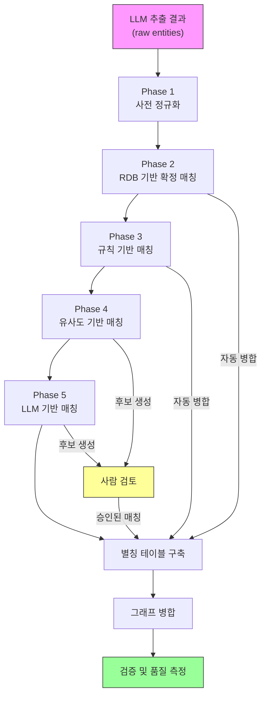

# 한국 금융상품 GraphRAG — Entity Resolution 체계적 가이드

## 목차

1. [왜 Entity Resolution인가](#1-왜-entity-resolution인가)
2. [한국 금융상품 도메인의 ER 난제](#2-한국-금융상품-도메인의-er-난제)
3. [ER 파이프라인 아키텍처](#3-er-파이프라인-아키텍처)
4. [Phase 1: 사전 정규화 (Pre-normalization)](#4-phase-1-사전-정규화)
5. [Phase 2: RDB 기반 확정 매칭](#5-phase-2-rdb-기반-확정-매칭)
6. [Phase 3: 규칙 기반 매칭](#6-phase-3-규칙-기반-매칭)
7. [Phase 4: 유사도 기반 매칭](#7-phase-4-유사도-기반-매칭)
8. [Phase 5: LLM 기반 매칭](#8-phase-5-llm-기반-매칭)
9. [별칭 테이블 (Alias Registry) 설계](#9-별칭-테이블-설계)
10. [그래프 병합 (Graph Merge) 전략](#10-그래프-병합-전략)
11. [검증 및 품질 메트릭](#11-검증-및-품질-메트릭)
12. [엔티티 타입별 ER 전략](#12-엔티티-타입별-er-전략)
13. [운영 및 유지보수](#13-운영-및-유지보수)

---

## 1. 왜 Entity Resolution인가

### 1.1 문제 정의

GraphRAG에서 LLM 추출은 **문서(청크) 단위**로 수행된다.
동일한 실체(entity)가 서로 다른 문서에서 다른 이름으로 추출되면,
그래프에 **중복 노드**가 생성되어 노드 간 경로가 단절된다.

```
문서 A에서 추출:  "TIGER 미국S&P500 ETF"
문서 B에서 추출:  "미래에셋TIGER미국S&P500증권상장지수투자신탁(주식)"
문서 C에서 추출:  "TIGER US S&P500"

→ 3개의 별도 노드 생성 → multi-hop 질문 시 관계 단절
```

### 1.2 ER이 GraphRAG 성능에 미치는 영향

| ER 수행 여부 | 기대 영향 |
|------------|----------|
| ER 미수행 | 그래프 단편화 → multi-hop 질문 정확도 급락, 집계 질문 불완전 |
| ER 수행 | 연결된 그래프 → 2-hop/3-hop 추론 가능, 집계 정확도 향상 |

**정량적 기대치**: ER 수행 시 multi-hop 질문 정확도 20~40%p 향상 (업계 벤치마크 기준)

### 1.3 ER의 범위

Entity Resolution은 넓은 의미에서 다음을 포함한다:

- **Entity Deduplication**: 같은 엔티티의 중복 노드 병합
- **Entity Linking**: 추출된 엔티티를 외부 지식(RDB, 표준코드)에 연결
- **Coreference Resolution**: "이 상품", "해당 ETF" 같은 대명사를 실체에 연결
- **Canonicalization**: 공식 이름(canonical name)으로 통일

이 가이드는 위 4가지를 모두 다룬다.

---

## 2. 한국 금융상품 도메인의 ER 난제

### 2.1 금융상품명의 변형 패턴

한국 금융상품(특히 ETF, 펀드)은 하나의 상품이 **5가지 이상**의 이름으로 등장한다.

```
┌─────────────────────────────────────────────────────────────────┐
│  동일 상품의 이름 변형 예시                                        │
├─────────────────────────────────────────────────────────────────┤
│  1. 정식명칭(투자설명서):                                         │
│     "미래에셋TIGER미국S&P500증권상장지수투자신탁(주식)"               │
│                                                                 │
│  2. 브랜드명(마케팅):                                             │
│     "TIGER 미국S&P500 ETF"                                      │
│                                                                 │
│  3. 약칭(구어):                                                  │
│     "타이거 미국에스앤피" / "TIGER S&P500"                         │
│                                                                 │
│  4. 종목코드:                                                    │
│     360750 (ticker) / KR7360750004 (ISIN)                       │
│                                                                 │
│  5. 영문명:                                                      │
│     "Mirae Asset TIGER US S&P500 ETF"                           │
│                                                                 │
│  6. 클래스 변형:                                                  │
│     "TIGER 미국S&P500 ETF(H)" ← 환헤지 클래스                    │
│     "TIGER 미국S&P500 ETF"    ← 비헤지 클래스                    │
└─────────────────────────────────────────────────────────────────┘
```

### 2.2 엔티티 타입별 난이도

| 엔티티 타입 | 난이도 | 주요 어려움 |
|-----------|-------|-----------|
| **ETF/펀드 상품** | ★★★★★ | 정식명·브랜드명·약칭·코드·영문명 모두 다름, 클래스 변형 존재 |
| **운용사/기관** | ★★★☆☆ | "미래에셋자산운용" vs "미래에셋" vs "Mirae Asset", 법인명 변경 이력 |
| **지수 (Index)** | ★★★★☆ | "S&P 500" vs "S&P500" vs "스탠더드앤드푸어스500", 지수 제공사에 따라 표기 상이 |
| **섹터/업종** | ★★☆☆☆ | KRX 분류 vs GICS 분류 vs 자체 분류, 한영 혼용 |
| **법규/규정** | ★★☆☆☆ | "자본시장과 금융투자업에 관한 법률" vs "자본시장법" vs "자통법" |
| **자산클래스** | ★☆☆☆☆ | 비교적 표준적이나 한영 혼용 ("채권" vs "Bond") |

### 2.3 한국 금융 도메인 특수 문제

**1) 한영 혼용**
```
"미래에셋TIGER미국S&P500" — 한글, 영문, 숫자, 특수문자가 한 이름에 혼재
```

**2) 접미사 패턴의 복잡성**
```
"...증권상장지수투자신탁(주식)"
"...증권상장지수투자신탁(주식-파생형)"
"...증권상장지수투자신탁(채권혼합)"
"...증권상장지수투자신탁(합성-파생형)"
→ 접미사만으로 상품 유형 정보를 담고 있어 단순 제거 불가
```

**3) 브랜드 체계의 중첩**
```
미래에셋: TIGER
삼성:     KODEX
KB:       KBSTAR
한화:     ARIRANG
NH-Amundi: HANARO
→ 같은 벤치마크를 추적하는 다른 브랜드 상품 구별 필요
```

**4) 시계열 변동**
```
법인명 변경:  "미래에셋맵스자산운용" → "미래에셋자산운용"
상품명 변경:  "TIGER 200" → "TIGER KOSPI200"
코드 변경:    합병/분할 시 종목코드 변경
```

---

## 3. ER 파이프라인 아키텍처

### 3.1 전체 흐름



### 3.2 단계별 신뢰도와 자동화 수준

| Phase | 방법 | 신뢰도 | 자동화 | 적용 대상 |
|-------|------|-------|-------|----------|
| 1 | 사전 정규화 | - | 완전 자동 | 모든 엔티티 |
| 2 | RDB 매칭 | ★★★★★ | 완전 자동 | RDB에 존재하는 엔티티 |
| 3 | 규칙 매칭 | ★★★★☆ | 완전 자동 | 정규화 패턴이 명확한 엔티티 |
| 4 | 유사도 매칭 | ★★★☆☆ | 반자동 | 규칙으로 못 잡은 후보 |
| 5 | LLM 매칭 | ★★☆☆☆ | 반자동 | 유사도로도 애매한 경우 |

### 3.3 설계 원칙

```
1. 높은 신뢰도 먼저 (High-confidence first)
   → RDB 확정 매칭으로 대부분 해소, 나머지만 후속 단계로

2. 거짓 병합 방지 (Precision over Recall)
   → 병합하지 않는 것보다 잘못 병합하는 것이 더 위험
   → 의심스러우면 병합하지 않고 사람 검토로 넘김

3. 엔티티 타입별 분리 처리
   → ETF 상품과 기관은 ER 규칙이 완전히 다름
   → 타입별 전용 파이프라인 구성

4. 점진적 확장 (Incremental)
   → 새 문서 추가 시 기존 별칭 테이블과 매칭 먼저 시도
   → 매칭 안 되는 것만 신규 ER 파이프라인 통과

5. 추적 가능성 (Traceability)
   → 모든 병합에 근거(source) 기록
   → 나중에 잘못된 병합을 되돌릴 수 있도록
```

---

## 4. Phase 1: 사전 정규화

LLM이 추출한 raw entity name을 일관된 형태로 변환하는 전처리 단계.
매칭 전에 수행하여 후속 Phase의 정확도를 높인다.

### 4.1 정규화 규칙

```python
import re
import unicodedata

class EntityNormalizer:
    """엔티티 이름 사전 정규화."""

    def normalize(self, name: str, entity_type: str) -> str:
        """엔티티 타입에 따른 정규화 수행."""
        name = self._basic_normalize(name)

        if entity_type == "ETF_PRODUCT":
            return self._normalize_product(name)
        elif entity_type == "ORGANIZATION":
            return self._normalize_organization(name)
        elif entity_type == "INDEX":
            return self._normalize_index(name)
        elif entity_type == "REGULATION":
            return self._normalize_regulation(name)
        else:
            return name

    def _basic_normalize(self, name: str) -> str:
        """공통 정규화."""
        # 1. 유니코드 정규화 (NFC: 한글 자모 결합)
        name = unicodedata.normalize("NFC", name)
        # 2. 양쪽 공백 제거
        name = name.strip()
        # 3. 연속 공백을 단일 공백으로
        name = re.sub(r"\s+", " ", name)
        # 4. 전각 문자를 반각으로
        name = name.replace("（", "(").replace("）", ")")
        name = name.replace("，", ",").replace("．", ".")
        return name

    def _normalize_product(self, name: str) -> str:
        """ETF/펀드 상품명 정규화."""
        # 1. 정식명칭의 접미사 추출 후 제거 (메타데이터로 별도 보존)
        suffix_match = re.search(
            r"(증권)?상장지수투자신탁\((.*?)\)$", name
        )
        fund_type = suffix_match.group(2) if suffix_match else None
        name = re.sub(r"(증권)?상장지수투자신탁\(.*?\)$", "", name).strip()

        # 2. 운용사 접두사 정규화
        name = re.sub(r"^미래에셋\s*", "", name)
        name = re.sub(r"^삼성\s*", "", name)
        name = re.sub(r"^KB\s*", "", name)

        # 3. 브랜드명과 상품명 사이 공백 정규화
        name = re.sub(r"(TIGER|KODEX|KBSTAR)\s*", r"\1 ", name)

        # 4. "ETF" 접미사 통일
        name = re.sub(r"\s*ETF$", "", name)  # 일단 제거
        # (canonical name 결정 시 다시 추가)

        return name.strip()

    def _normalize_organization(self, name: str) -> str:
        """기관명 정규화."""
        # "주식회사", "(주)" 등 법인 유형 제거
        name = re.sub(r"\(주\)|주식회사|㈜", "", name)
        # "자산운용" 계열 통일
        name = re.sub(r"자산운용사?", "자산운용", name)
        return name.strip()

    def _normalize_index(self, name: str) -> str:
        """지수명 정규화."""
        # S&P 표기 통일
        name = re.sub(r"S\s*&\s*P\s*", "S&P ", name)
        # "Total Return" / "TR" 통일
        name = re.sub(r"\bTR\b", "Total Return", name)
        return name.strip()

    def _normalize_regulation(self, name: str) -> str:
        """법규명 정규화."""
        # 약칭 → 정식명 매핑은 별도 사전으로 처리
        return name.strip()
```

### 4.2 정규화 시 주의사항

```
⚠️  정규화 ≠ canonical name 결정
    정규화는 매칭 정확도를 높이기 위한 전처리일 뿐,
    최종 canonical name은 Phase 2(RDB)에서 결정한다.

⚠️  원본 보존
    정규화된 이름과 원본 이름을 모두 저장해야 한다.
    (원본 → 정규화 → canonical 의 3단계 추적)

⚠️  정보 손실 방지
    정식명칭의 "(주식)", "(채권혼합)" 같은 접미사는
    상품 유형 정보를 담고 있으므로 메타데이터로 별도 보존.
```

---

## 5. Phase 2: RDB 기반 확정 매칭

RDB(관계형 데이터베이스)에 이미 정제된 마스터 데이터가 있다면,
이것이 가장 신뢰할 수 있는 ER 소스다.

### 5.1 매칭 키 우선순위

```
1순위: 종목코드 (ticker) — 유일 식별자, 완전 매칭
2순위: ISIN 코드 — 국제 표준 식별자
3순위: 정식명칭 (fund_name) — 투자설명서의 법적 명칭
4순위: 브랜드명 (name_ko) — RDB의 한글 표시명
5순위: 영문명 (name_en) — RDB의 영문 표시명
```

### 5.2 구현

```python
from dataclasses import dataclass, field

@dataclass
class CanonicalEntity:
    """RDB에서 확정된 공식 엔티티."""
    canonical_name: str          # 공식 표시명
    entity_type: str             # ETF_PRODUCT, ORGANIZATION, ...
    ticker: str | None = None
    isin: str | None = None
    fund_name: str | None = None # 정식명칭
    name_en: str | None = None
    aliases: list[str] = field(default_factory=list)
    metadata: dict = field(default_factory=dict)


class RDBMatcher:
    """RDB 마스터 데이터 기반 확정 매칭."""

    def __init__(self, db_connection):
        self.db = db_connection
        self._build_lookup_tables()

    def _build_lookup_tables(self):
        """RDB에서 lookup 테이블 구축."""
        # ETF 상품 마스터
        products = self.db.execute("""
            SELECT ticker, isin, name_ko, name_en, fund_name,
                   asset_class, benchmark_index
            FROM etf_products
        """)

        self.by_ticker = {}    # ticker → CanonicalEntity
        self.by_isin = {}      # ISIN → CanonicalEntity
        self.by_name = {}      # 정규화된 이름 → CanonicalEntity

        normalizer = EntityNormalizer()

        for row in products:
            entity = CanonicalEntity(
                canonical_name=row["name_ko"],
                entity_type="ETF_PRODUCT",
                ticker=row["ticker"],
                isin=row["isin"],
                fund_name=row["fund_name"],
                name_en=row["name_en"],
                aliases=[],
                metadata={
                    "asset_class": row["asset_class"],
                    "benchmark": row["benchmark_index"],
                },
            )

            # 모든 알려진 이름을 aliases에 등록
            known_names = [
                row["name_ko"],
                row["name_en"],
                row["fund_name"],
                row["ticker"],
                row["isin"],
            ]
            for n in known_names:
                if n:
                    entity.aliases.append(n)
                    normalized = normalizer.normalize(n, "ETF_PRODUCT")
                    entity.aliases.append(normalized)

            if row["ticker"]:
                self.by_ticker[row["ticker"]] = entity
            if row["isin"]:
                self.by_isin[row["isin"]] = entity
            for alias in entity.aliases:
                self.by_name[alias.lower()] = entity

    def match(self, extracted_name: str, entity_type: str) -> CanonicalEntity | None:
        """추출된 엔티티명을 RDB 마스터와 매칭."""
        # 1) 코드 직접 매칭
        if extracted_name in self.by_ticker:
            return self.by_ticker[extracted_name]
        if extracted_name in self.by_isin:
            return self.by_isin[extracted_name]

        # 2) 이름 매칭 (정규화 후)
        normalizer = EntityNormalizer()
        normalized = normalizer.normalize(extracted_name, entity_type)
        if normalized.lower() in self.by_name:
            return self.by_name[normalized.lower()]

        # 3) 부분 매칭 — ticker가 이름에 포함된 경우
        for ticker, entity in self.by_ticker.items():
            if ticker in extracted_name:
                return entity

        return None  # 매칭 실패 → 다음 Phase로
```

### 5.3 RDB 매칭 기대 커버리지

```
ETF 상품:    ~80% (RDB에 마스터 데이터 존재)
운용사/기관:  ~60% (주요 기관만 RDB에 존재)
지수:        ~50% (벤치마크 지수만 RDB에 존재)
법규:        ~10% (대부분 RDB에 없음)
섹터:        ~30% (분류 체계에 따라 상이)
```

→ Phase 2에서 전체의 약 **50~60%** 를 해소할 수 있다.

---

## 6. Phase 3: 규칙 기반 매칭

RDB에 없는 엔티티나, RDB 매칭에 실패한 엔티티를 대상으로
도메인 전문 규칙으로 매칭한다.

### 6.1 규칙 카테고리

#### A. 접미사/접두사 제거 후 매칭

```python
class SuffixStripRules:
    """접미사 제거 규칙 (한국 금융상품 전용)."""

    # 투자신탁 접미사 패턴
    FUND_SUFFIXES = [
        r"증권상장지수투자신탁\(.*?\)",
        r"증권투자신탁\(.*?\)",
        r"사모증권투자신탁\(.*?\)",
    ]

    # 운용사 접두사
    AMC_PREFIXES = [
        "미래에셋", "삼성", "KB", "한화", "NH-Amundi",
        "키움", "신한", "한국투자", "교보악사",
    ]

    # ETF 접미사
    ETF_SUFFIXES = [r"\s*ETF$", r"\s*상장지수펀드$"]

    @classmethod
    def strip_and_match(cls, name_a: str, name_b: str) -> bool:
        """접미사/접두사를 제거한 후 비교."""
        core_a = cls._extract_core(name_a)
        core_b = cls._extract_core(name_b)
        return core_a == core_b and len(core_a) > 3

    @classmethod
    def _extract_core(cls, name: str) -> str:
        for pattern in cls.FUND_SUFFIXES + cls.ETF_SUFFIXES:
            name = re.sub(pattern, "", name)
        for prefix in cls.AMC_PREFIXES:
            name = re.sub(f"^{prefix}\\s*", "", name)
        return name.strip().lower()
```

#### B. 약칭 사전 (Abbreviation Dictionary)

```python
# 도메인 전문가가 관리하는 약칭 사전
ABBREVIATION_DICT = {
    # 법규
    "자본시장법": "자본시장과 금융투자업에 관한 법률",
    "자통법": "자본시장과 금융투자업에 관한 법률",
    "금투법": "자본시장과 금융투자업에 관한 법률",
    "금소법": "금융소비자 보호에 관한 법률",

    # 기관
    "금감원": "금융감독원",
    "금융위": "금융위원회",
    "한국거래소": "한국거래소",
    "KRX": "한국거래소",

    # 지수
    "코스피": "KOSPI",
    "코스피200": "KOSPI 200",
    "코스닥": "KOSDAQ",
    "S&P500": "S&P 500",
    "나스닥": "NASDAQ",
    "나스닥100": "NASDAQ 100",
    "다우": "Dow Jones",
    "다우존스": "Dow Jones",

    # 자산
    "미국채": "미국 국채",
    "미국국채": "미국 국채",
    "UST": "미국 국채",
}

class AbbreviationMatcher:
    """약칭 사전 기반 매칭."""

    def __init__(self, dictionary: dict[str, str]):
        # 양방향 매핑 구축
        self.to_canonical = {}
        for abbr, canonical in dictionary.items():
            self.to_canonical[abbr.lower()] = canonical
            self.to_canonical[canonical.lower()] = canonical

    def match(self, name_a: str, name_b: str) -> bool:
        """두 이름이 같은 canonical로 매핑되는지 확인."""
        canon_a = self.to_canonical.get(name_a.lower(), name_a.lower())
        canon_b = self.to_canonical.get(name_b.lower(), name_b.lower())
        return canon_a == canon_b
```

#### C. 한영 매핑 규칙

```python
# 자주 등장하는 한영 매핑
KO_EN_MAP = {
    "미국": "US",
    "중국": "China",
    "유럽": "Europe",
    "일본": "Japan",
    "배당": "Dividend",
    "채권": "Bond",
    "국채": "Treasury",
    "반도체": "Semiconductor",
    "커버드콜": "Covered Call",
    "성장": "Growth",
    "가치": "Value",
}
```

### 6.2 규칙 매칭 실행 흐름

```
입력: Phase 2에서 미매칭된 엔티티 목록

1. 모든 미매칭 엔티티 쌍 생성 (같은 entity_type 내에서만)
2. 각 쌍에 대해 규칙 적용:
   a. 접미사 제거 후 매칭 → 일치하면 자동 병합
   b. 약칭 사전 매칭 → 일치하면 자동 병합
   c. 한영 매핑 후 매칭 → 일치하면 자동 병합
3. 매칭된 쌍을 별칭 테이블에 등록
```

### 6.3 규칙 관리

```
⚠️  규칙은 코드가 아닌 설정 파일로 관리

rules/
├── suffix_patterns.yaml     # 접미사/접두사 패턴
├── abbreviations.yaml       # 약칭 사전
├── ko_en_mappings.yaml      # 한영 매핑
└── known_aliases.yaml       # 수동 확인된 별칭 쌍

→ 도메인 전문가가 코드 수정 없이 규칙 추가/수정 가능
→ Git 버전 관리로 규칙 변경 이력 추적
```

---

## 7. Phase 4: 유사도 기반 매칭

규칙으로 매칭되지 않은 엔티티 중, 문자열 또는 의미 유사도가 높은 후보 쌍을 탐색한다.
**자동 병합이 아닌 후보 생성** 단계 — 사람이 검토 후 승인한다.

### 7.1 문자열 유사도

```python
from rapidfuzz import fuzz
from rapidfuzz.distance import JaroWinkler

class StringSimilarityMatcher:
    """문자열 유사도 기반 후보 탐색."""

    def __init__(
        self,
        jaro_threshold: float = 0.85,
        token_sort_threshold: float = 0.80,
    ):
        self.jaro_threshold = jaro_threshold
        self.token_sort_threshold = token_sort_threshold

    def find_candidates(
        self, unmatched: list[str]
    ) -> list[tuple[str, str, float, str]]:
        """미매칭 엔티티에서 유사 쌍 탐색.

        Returns:
            list of (name_a, name_b, score, method)
        """
        candidates = []
        for i, a in enumerate(unmatched):
            for b in unmatched[i + 1:]:
                # Jaro-Winkler: 접두사가 같은 문자열에 유리
                jw_score = JaroWinkler.similarity(a, b)
                if jw_score >= self.jaro_threshold:
                    candidates.append((a, b, jw_score, "jaro_winkler"))
                    continue

                # Token Sort Ratio: 단어 순서가 다른 경우에 유리
                # "TIGER 미국S&P500" vs "미국S&P500 TIGER"
                ts_score = fuzz.token_sort_ratio(a, b) / 100
                if ts_score >= self.token_sort_threshold:
                    candidates.append((a, b, ts_score, "token_sort"))

        return sorted(candidates, key=lambda x: -x[2])
```

### 7.2 임베딩 유사도

```python
import numpy as np

class EmbeddingSimilarityMatcher:
    """임베딩 코사인 유사도 기반 후보 탐색."""

    def __init__(self, embedding_model, cosine_threshold: float = 0.90):
        self.model = embedding_model
        self.threshold = cosine_threshold

    def find_candidates(
        self, unmatched: list[str]
    ) -> list[tuple[str, str, float]]:
        """임베딩 기반 유사 쌍 탐색."""
        # 1. 모든 미매칭 엔티티 임베딩 생성
        embeddings = self.model.embed_batch(unmatched)

        # 2. 코사인 유사도 행렬 계산
        norms = np.linalg.norm(embeddings, axis=1, keepdims=True)
        normalized = embeddings / norms
        sim_matrix = normalized @ normalized.T

        # 3. 임계치 이상인 쌍 추출
        candidates = []
        for i in range(len(unmatched)):
            for j in range(i + 1, len(unmatched)):
                if sim_matrix[i][j] >= self.threshold:
                    candidates.append(
                        (unmatched[i], unmatched[j], float(sim_matrix[i][j]))
                    )

        return sorted(candidates, key=lambda x: -x[2])
```

### 7.3 Blocking 전략 (성능 최적화)

모든 엔티티 쌍을 비교하면 O(n²)이므로, blocking으로 비교 대상을 축소한다.

```python
class BlockingStrategy:
    """비교 대상 축소를 위한 blocking."""

    @staticmethod
    def by_entity_type(entities: list[dict]) -> dict[str, list]:
        """같은 entity_type 내에서만 비교."""
        blocks = {}
        for e in entities:
            t = e["entity_type"]
            blocks.setdefault(t, []).append(e)
        return blocks

    @staticmethod
    def by_first_token(entities: list[dict]) -> dict[str, list]:
        """첫 번째 토큰이 같은 엔티티끼리 비교.
        예: "TIGER ..."로 시작하는 엔티티끼리만.
        """
        blocks = {}
        for e in entities:
            token = e["name"].split()[0] if e["name"] else ""
            blocks.setdefault(token, []).append(e)
        return blocks

    @staticmethod
    def by_ngram(entities: list[dict], n: int = 3) -> dict[str, list]:
        """n-gram이 겹치는 엔티티끼리 비교."""
        blocks = {}
        for e in entities:
            ngrams = {
                e["name"][i:i+n]
                for i in range(len(e["name"]) - n + 1)
            }
            for ng in ngrams:
                blocks.setdefault(ng, []).append(e)
        return blocks
```

### 7.4 임계치 튜닝 가이드

```
임계치를 너무 낮게 설정 → 거짓 매칭 증가 (다른 상품 병합)
임계치를 너무 높게 설정 → 매칭 누락 증가 (중복 잔존)

권장 튜닝 방법:
1. 소규모 라벨링 데이터 준비 (100쌍: 50 매칭 + 50 비매칭)
2. 임계치를 0.70~0.95 범위에서 0.05 단위로 변경
3. Precision/Recall 커브 그리기
4. F1이 최대인 지점 선택

한국 금융상품 권장 시작값:
- Jaro-Winkler: 0.85
- Token Sort Ratio: 0.80
- 임베딩 코사인: 0.90
```

---

## 8. Phase 5: LLM 기반 매칭

유사도 기반으로도 판단이 어려운 경우, LLM에게 두 엔티티가 동일한지 판별을 요청한다.
비용이 높으므로 **마지막 수단**으로만 사용한다.

### 8.1 적용 대상

```
Phase 4에서 유사도가 중간 범위인 쌍:
- Jaro-Winkler: 0.70 ~ 0.85 (자동 매칭 임계치 미만, 무시 임계치 초과)
- 임베딩 코사인: 0.80 ~ 0.90

→ 이 "회색 영역" 쌍만 LLM에게 질의
```

### 8.2 프롬프트 설계

```python
LLM_ER_PROMPT = """당신은 한국 금융상품 전문가입니다.
아래 두 엔티티가 동일한 실체(entity)를 지칭하는지 판별해주세요.

엔티티 A: {entity_a}
  - 타입: {type_a}
  - 출처 문서: {source_a}
  - 주변 컨텍스트: {context_a}

엔티티 B: {entity_b}
  - 타입: {type_b}
  - 출처 문서: {source_b}
  - 주변 컨텍스트: {context_b}

판별 기준:
1. 같은 금융상품/기관/지수를 지칭하면 SAME
2. 비슷하지만 다른 실체이면 DIFFERENT
   (예: "TIGER 미국S&P500" vs "TIGER 미국S&P500(H)"는 환헤지 여부가 다르므로 DIFFERENT)
3. 판단이 불가능하면 UNCERTAIN

반드시 아래 JSON 형식으로만 응답하세요:
{{
  "decision": "SAME" | "DIFFERENT" | "UNCERTAIN",
  "confidence": 0.0~1.0,
  "reason": "판별 근거를 한 문장으로"
}}
"""
```

### 8.3 구현

```python
import json

class LLMMatcher:
    """LLM 기반 엔티티 매칭."""

    def __init__(self, llm_client, model_id: str = "anthropic.claude-sonnet-4-20250514"):
        self.llm = llm_client
        self.model_id = model_id

    def judge(
        self,
        entity_a: dict,
        entity_b: dict,
    ) -> dict:
        """LLM에게 두 엔티티의 동일성 판별 요청."""
        prompt = LLM_ER_PROMPT.format(
            entity_a=entity_a["name"],
            type_a=entity_a["entity_type"],
            source_a=entity_a.get("source_doc", "unknown"),
            context_a=entity_a.get("context", ""),
            entity_b=entity_b["name"],
            type_b=entity_b["entity_type"],
            source_b=entity_b.get("source_doc", "unknown"),
            context_b=entity_b.get("context", ""),
        )

        response = self.llm.invoke(
            model_id=self.model_id,
            messages=[{"role": "user", "content": prompt}],
            max_tokens=200,
        )

        return json.loads(response["content"])

    def batch_judge(
        self,
        candidate_pairs: list[tuple[dict, dict]],
        auto_merge_threshold: float = 0.95,
    ) -> dict:
        """후보 쌍 일괄 판별.

        Returns:
            {
                "auto_merge": [...],     # confidence >= threshold
                "human_review": [...],   # SAME이지만 confidence < threshold
                "different": [...],      # DIFFERENT
                "uncertain": [...],      # UNCERTAIN
            }
        """
        results = {
            "auto_merge": [],
            "human_review": [],
            "different": [],
            "uncertain": [],
        }

        for a, b in candidate_pairs:
            judgment = self.judge(a, b)

            if judgment["decision"] == "SAME":
                if judgment["confidence"] >= auto_merge_threshold:
                    results["auto_merge"].append((a, b, judgment))
                else:
                    results["human_review"].append((a, b, judgment))
            elif judgment["decision"] == "DIFFERENT":
                results["different"].append((a, b, judgment))
            else:
                results["uncertain"].append((a, b, judgment))

        return results
```

### 8.4 비용 제어

```
LLM 호출 비용을 억제하기 위한 전략:

1. Blocking으로 후보 수 최소화 (Phase 4에서 회색 영역만)
2. 저렴한 모델 사용 (Haiku로 1차 판별 → 불확실한 건만 Sonnet으로)
3. 배치 처리 (Batch API 활용 시 50% 비용 절감)
4. 캐싱 (동일 쌍 재판별 방지)

예상 비용 (100쌍 기준):
- Haiku: ~$0.05
- Sonnet: ~$0.50
- 2단계 (Haiku→Sonnet): ~$0.15
```

---

## 9. 별칭 테이블 (Alias Registry) 설계

모든 Phase의 매칭 결과를 하나의 별칭 테이블로 통합 관리한다.

### 9.1 스키마

```sql
-- 공식 엔티티 테이블
CREATE TABLE canonical_entities (
    id            SERIAL PRIMARY KEY,
    canonical_name TEXT NOT NULL,
    entity_type   TEXT NOT NULL,
    ticker        TEXT,
    isin          TEXT,
    neo4j_node_id TEXT,           -- Neo4j 내부 노드 ID
    created_at    TIMESTAMP DEFAULT NOW(),
    updated_at    TIMESTAMP DEFAULT NOW(),

    UNIQUE(canonical_name, entity_type)
);

-- 별칭 매핑 테이블
CREATE TABLE entity_aliases (
    id              SERIAL PRIMARY KEY,
    canonical_id    INTEGER REFERENCES canonical_entities(id),
    alias           TEXT NOT NULL,
    alias_type      TEXT NOT NULL,  -- 'formal_name', 'brand_name',
                                    -- 'abbreviation', 'english', 'code'
    match_phase     TEXT NOT NULL,  -- 'rdb', 'rule', 'similarity', 'llm', 'manual'
    match_score     FLOAT,         -- 매칭 시 유사도 점수 (있는 경우)
    verified        BOOLEAN DEFAULT FALSE,  -- 사람 확인 여부
    source_doc      TEXT,          -- 이 별칭이 등장한 소스 문서
    created_at      TIMESTAMP DEFAULT NOW(),

    UNIQUE(alias, canonical_id)
);

-- 병합 이력 테이블 (감사 추적)
CREATE TABLE merge_history (
    id            SERIAL PRIMARY KEY,
    source_name   TEXT NOT NULL,    -- 병합 전 이름
    target_id     INTEGER REFERENCES canonical_entities(id),
    match_phase   TEXT NOT NULL,
    match_score   FLOAT,
    merged_by     TEXT NOT NULL,    -- 'system' or 사용자 이름
    reason        TEXT,
    created_at    TIMESTAMP DEFAULT NOW()
);
```

### 9.2 별칭 테이블 활용

```python
class AliasRegistry:
    """별칭 테이블 관리 및 조회."""

    def __init__(self, db):
        self.db = db
        self._cache = {}  # alias → canonical_name 캐시

    def resolve(self, name: str) -> str | None:
        """이름을 canonical name으로 해소."""
        if name in self._cache:
            return self._cache[name]

        result = self.db.execute("""
            SELECT c.canonical_name
            FROM entity_aliases a
            JOIN canonical_entities c ON a.canonical_id = c.id
            WHERE LOWER(a.alias) = LOWER(%s)
        """, [name])

        if result:
            canonical = result[0]["canonical_name"]
            self._cache[name] = canonical
            return canonical
        return None

    def register(
        self,
        canonical_name: str,
        entity_type: str,
        alias: str,
        alias_type: str,
        match_phase: str,
        match_score: float | None = None,
    ):
        """새 별칭 등록."""
        # canonical 엔티티 존재 확인/생성
        canonical_id = self._ensure_canonical(canonical_name, entity_type)

        self.db.execute("""
            INSERT INTO entity_aliases
                (canonical_id, alias, alias_type, match_phase, match_score)
            VALUES (%s, %s, %s, %s, %s)
            ON CONFLICT (alias, canonical_id) DO NOTHING
        """, [canonical_id, alias, alias_type, match_phase, match_score])

        # 캐시 갱신
        self._cache[alias] = canonical_name

    def _ensure_canonical(self, name: str, entity_type: str) -> int:
        """canonical 엔티티가 없으면 생성."""
        result = self.db.execute("""
            INSERT INTO canonical_entities (canonical_name, entity_type)
            VALUES (%s, %s)
            ON CONFLICT (canonical_name, entity_type)
            DO UPDATE SET updated_at = NOW()
            RETURNING id
        """, [name, entity_type])
        return result[0]["id"]
```

### 9.3 추출 시점 활용 (Extraction-time Resolution)

별칭 테이블이 구축되면, **신규 문서 추출 시점에** 바로 적용할 수 있다:

```python
class ExtractionTimeResolver:
    """LLM 추출 직후 별칭 테이블로 즉시 해소."""

    def __init__(self, alias_registry: AliasRegistry):
        self.registry = alias_registry

    def resolve_extracted_entities(
        self, entities: list[dict]
    ) -> list[dict]:
        """추출된 엔티티 목록에서 canonical name으로 치환."""
        resolved = []
        for entity in entities:
            canonical = self.registry.resolve(entity["name"])
            if canonical:
                entity["original_name"] = entity["name"]
                entity["name"] = canonical
                entity["resolved"] = True
            else:
                entity["resolved"] = False
            resolved.append(entity)
        return resolved
```

→ 별칭 테이블이 성숙할수록 **신규 문서의 ER 비용이 감소**한다.

---

## 10. 그래프 병합 (Graph Merge) 전략

별칭 테이블에서 확정된 매칭을 Neo4j 그래프에 실제 반영하는 단계.

### 10.1 병합 Cypher 패턴

```cypher
// 1. 두 노드를 하나로 병합 (apoc 사용)
MATCH (keep:__Entity__ {name: $canonical_name})
MATCH (remove:__Entity__ {name: $alias_name})
WHERE keep <> remove
CALL apoc.refactor.mergeNodes([keep, remove], {
    properties: "combine",
    mergeRels: true
})
YIELD node
RETURN node
```

```cypher
// 2. apoc 없이 수동 병합
// 2a. 관계 이전
MATCH (remove:__Entity__ {name: $alias_name})-[r]->(target)
MATCH (keep:__Entity__ {name: $canonical_name})
WHERE keep <> remove
CALL {
    WITH keep, r, target
    WITH keep, target, type(r) AS relType, properties(r) AS relProps
    CALL apoc.create.relationship(keep, relType, relProps, target)
    YIELD rel
    RETURN rel
}

// 2b. 역방향 관계도 이전
MATCH (source)-[r]->(remove:__Entity__ {name: $alias_name})
MATCH (keep:__Entity__ {name: $canonical_name})
WHERE keep <> remove
CALL {
    WITH keep, r, source
    WITH keep, source, type(r) AS relType, properties(r) AS relProps
    CALL apoc.create.relationship(source, relType, relProps, keep)
    YIELD rel
    RETURN rel
}

// 2c. 원본 노드 삭제
MATCH (remove:__Entity__ {name: $alias_name})
DETACH DELETE remove
```

### 10.2 속성 충돌 해소

```
두 노드의 속성 값이 다를 때:

전략 1: RDB 우선 (권장)
  - RDB에서 온 속성 값을 우선 채택

전략 2: 최신 우선
  - 추출 시점이 더 최근인 값을 채택

전략 3: 다수결
  - 더 많은 소스에서 등장한 값을 채택

전략 4: 병합
  - 리스트형 속성은 합집합 (예: aliases, source_documents)
  - 수치형 속성은 신뢰도 기반 선택
```

### 10.3 병합 실행 코드

```python
class GraphMerger:
    """Neo4j 그래프 병합 실행."""

    def __init__(self, neo4j_driver):
        self.driver = neo4j_driver

    def merge_entity(
        self, canonical_name: str, alias_name: str, merge_reason: str
    ) -> bool:
        """alias_name 노드를 canonical_name 노드로 병합."""
        with self.driver.session() as session:
            # 1. 두 노드 존재 확인
            exists = session.run("""
                MATCH (a:__Entity__ {name: $canonical})
                MATCH (b:__Entity__ {name: $alias})
                RETURN count(a) AS ca, count(b) AS cb
            """, canonical=canonical_name, alias=alias_name).single()

            if not exists or exists["ca"] == 0 or exists["cb"] == 0:
                return False  # 노드가 없으면 스킵

            # 2. 병합 실행
            session.run("""
                MATCH (keep:__Entity__ {name: $canonical})
                MATCH (remove:__Entity__ {name: $alias})
                WHERE keep <> remove
                // 별칭 속성 추가
                SET keep.aliases = coalesce(keep.aliases, [])
                    + [$alias]
                SET keep.merge_history = coalesce(keep.merge_history, [])
                    + [$reason]
                WITH keep, remove
                // apoc 병합
                CALL apoc.refactor.mergeNodes([keep, remove], {
                    properties: "combine",
                    mergeRels: true
                }) YIELD node
                RETURN node
            """, canonical=canonical_name, alias=alias_name,
                 reason=merge_reason)

            return True

    def batch_merge(self, merge_pairs: list[dict]) -> dict:
        """일괄 병합 실행."""
        success, failed = 0, 0
        for pair in merge_pairs:
            ok = self.merge_entity(
                pair["canonical"], pair["alias"], pair["reason"]
            )
            if ok:
                success += 1
            else:
                failed += 1
        return {"success": success, "failed": failed}
```

---

## 11. 검증 및 품질 메트릭

### 11.1 ER 전후 그래프 비교 메트릭

| 메트릭 | Cypher 쿼리 | ER 전 목표 → ER 후 목표 |
|-------|------------|----------------------|
| 총 노드 수 | `MATCH (n:__Entity__) RETURN count(n)` | 감소해야 함 (중복 제거) |
| 고립 노드 비율 | `MATCH (n) WHERE NOT (n)--() RETURN count(n)` | >15% → <5% |
| 평균 관계 수 | `MATCH (n)-[r]-() WITH n, count(r) AS rc RETURN avg(rc)` | <2 → >3 |
| 연결 컴포넌트 수 | `CALL gds.wcc.stream({nodeProjection:'*', relationshipProjection:'*'}) YIELD componentId RETURN count(DISTINCT componentId)` | 감소해야 함 |
| 최대 컴포넌트 크기 | WCC 결과에서 가장 큰 컴포넌트 | 증가해야 함 |

### 11.2 ER 정확도 측정

```
1. 병합된 쌍 중 50개 랜덤 샘플링
2. 도메인 전문가가 판별:
   - Correct Merge (올바른 병합)
   - Incorrect Merge (잘못된 병합 — 다른 엔티티를 병합)
3. Merge Precision = Correct / Total Sampled

4. 알려진 중복 쌍(gold standard) 100개 준비
5. 시스템이 이 중 몇 개를 찾았는지 확인
6. Merge Recall = Found / Gold Standard Total
```

### 11.3 자동 검증 스크립트

```python
class ERValidator:
    """ER 결과 자동 검증."""

    def __init__(self, neo4j_driver):
        self.driver = neo4j_driver

    def run_all_checks(self) -> dict:
        """모든 검증 실행."""
        return {
            "orphan_nodes": self._check_orphans(),
            "duplicate_suspects": self._check_remaining_duplicates(),
            "relation_direction": self._check_relation_directions(),
            "type_consistency": self._check_type_consistency(),
        }

    def _check_orphans(self) -> dict:
        """고립 노드 검사."""
        with self.driver.session() as s:
            result = s.run("""
                MATCH (n:__Entity__)
                WITH n, size([(n)-[]-() | 1]) AS degree
                RETURN
                    count(n) AS total,
                    sum(CASE WHEN degree = 0 THEN 1 ELSE 0 END) AS orphans
            """).single()
            total = result["total"]
            orphans = result["orphans"]
            return {
                "total": total,
                "orphans": orphans,
                "ratio": orphans / total if total > 0 else 0,
                "pass": (orphans / total < 0.05) if total > 0 else True,
            }

    def _check_remaining_duplicates(self) -> list:
        """병합 후에도 남아있는 의심 중복 탐지."""
        with self.driver.session() as s:
            # 이름이 매우 유사한 노드 쌍 탐색
            results = s.run("""
                MATCH (a:__Entity__), (b:__Entity__)
                WHERE id(a) < id(b)
                  AND a.entity_type = b.entity_type
                  AND apoc.text.jaroWinklerDistance(a.name, b.name) > 0.85
                RETURN a.name AS name_a, b.name AS name_b,
                       apoc.text.jaroWinklerDistance(a.name, b.name) AS sim
                ORDER BY sim DESC
                LIMIT 20
            """)
            return [dict(r) for r in results]

    def _check_relation_directions(self) -> list:
        """관계 방향 위반 검사 (예: ETF → MANAGES → Organization은 잘못됨)."""
        with self.driver.session() as s:
            violations = s.run("""
                MATCH (a)-[r:MANAGES]->(b)
                WHERE a.entity_type = 'ETF_PRODUCT'
                  AND b.entity_type = 'ORGANIZATION'
                RETURN a.name, type(r), b.name
                LIMIT 10
            """)
            return [dict(r) for r in violations]

    def _check_type_consistency(self) -> list:
        """병합 후 entity_type 불일치 검사."""
        with self.driver.session() as s:
            issues = s.run("""
                MATCH (n:__Entity__)
                WHERE size(n.aliases) > 0
                  AND n.entity_type IS NULL
                RETURN n.name, n.aliases
                LIMIT 10
            """)
            return [dict(r) for r in issues]
```

---

## 12. 엔티티 타입별 ER 전략

### 12.1 ETF/펀드 상품 (난이도 ★★★★★)

```
핵심 식별자: ticker (종목코드)
Canonical name: RDB의 name_ko (예: "TIGER 미국S&P500 ETF")

전략:
1. ticker/ISIN 매칭 (Phase 2) — 대부분 여기서 해소
2. 정식명칭 접미사 제거 후 매칭 (Phase 3)
3. 클래스 구분 주의:
   - "TIGER 미국S&P500 ETF"     ← 비헤지
   - "TIGER 미국S&P500 ETF(H)"  ← 환헤지
   → 이 둘은 별개 상품 (DIFFERENT)

위험:
- 같은 벤치마크의 다른 운용사 상품 병합 주의
  "TIGER 미국S&P500" ≠ "KODEX 미국S&P500"
- 동일 상품의 환헤지/비헤지 클래스 구분 필수
```

### 12.2 운용사/기관 (난이도 ★★★☆☆)

```
핵심 식별자: 금융투자업자 등록번호 (있는 경우)
Canonical name: 공식 법인명 (예: "미래에셋자산운용")

전략:
1. RDB 기관 테이블 매칭
2. 약칭 사전: "미래에셋" → "미래에셋자산운용"
3. 영문명 매핑: "Mirae Asset" → "미래에셋자산운용"

주의:
- 그룹사 구분: "미래에셋자산운용" ≠ "미래에셋증권" ≠ "미래에셋생명"
- 법인명 변경 이력: "미래에셋맵스자산운용" → "미래에셋자산운용" (같은 법인)
- 역할별 구분: "수탁회사로서의 국민은행" vs "판매회사로서의 국민은행"
  → 동일 노드, 관계 타입으로 구분
```

### 12.3 지수 (난이도 ★★★★☆)

```
핵심 식별자: 지수 코드 (Bloomberg ticker 등)
Canonical name: 공식 지수명 (예: "S&P 500 Total Return Index")

전략:
1. RDB benchmark_index 필드 매칭
2. 약칭 사전: "S&P500" → "S&P 500"
3. Price Return vs Total Return 구분

주의:
- "S&P 500" vs "S&P 500 Total Return" vs "S&P 500 Net Total Return"
  → 세 가지 다른 지수 (배당 재투자 방식 차이)
- "KOSPI 200" vs "KOSPI 200 TR" → 별개
- 지수 제공사별 표기: "KOSPI" (KRX) vs "Korea Composite Stock Price Index"
```

### 12.4 법규/규정 (난이도 ★★☆☆☆)

```
Canonical name: 법률 정식명칭

전략:
1. 약칭 사전 (가장 효과적)
   "자본시장법" = "자통법" = "금투법"
   → "자본시장과 금융투자업에 관한 법률"
2. 시행령/시행규칙 구분
   "자본시장법" ≠ "자본시장법 시행령"

약칭 사전이 사실상 유일한 방법이므로
도메인 전문가가 주기적으로 사전을 보강해야 함.
```

### 12.5 섹터/업종 (난이도 ★★☆☆☆)

```
핵심 과제: 분류 체계 통일

여러 분류 체계가 혼용됨:
- GICS (Global Industry Classification Standard)
- KRX 업종 분류
- 자체 분류 ("2차전지", "AI", "반도체")

전략:
1. 기준 분류 체계 선택 (GICS 권장)
2. 매핑 테이블 구축:
   "정보기술" (KRX) → "Information Technology" (GICS)
   "반도체" (자체) → "Semiconductors & Semiconductor Equipment" (GICS)
3. 한영 매핑 사전 적용
```

---

## 13. 운영 및 유지보수

### 13.1 신규 문서 추가 시 ER 흐름

```
1. 신규 PDF 입수
2. LLM 추출 (엔티티 + 관계)
3. Extraction-time Resolution:
   - 별칭 테이블 조회 → 기존 canonical에 매핑
   - 매핑 성공 → 기존 노드에 관계 연결
   - 매핑 실패 → 신규 엔티티 후보로 등록
4. 신규 후보에 대해 Phase 2~5 실행 (배치)
5. 별칭 테이블 갱신
6. 그래프 병합
7. 검증
```

### 13.2 정기 점검 항목

| 주기 | 점검 항목 |
|-----|---------|
| 매 배치 후 | 고립 노드 비율, 신규 중복 의심 쌍 |
| 주 1회 | 유사도 기반 후보 사람 검토, 별칭 테이블 정합성 |
| 월 1회 | 전체 그래프 품질 리포트, 규칙 사전 보강 |
| 분기 1회 | ER 정확도 샘플링 평가 (Precision/Recall) |

### 13.3 잘못된 병합 롤백

```python
def rollback_merge(
    neo4j_driver, merge_history_db,
    merge_id: int
) -> bool:
    """잘못된 병합을 되돌린다."""
    # 1. merge_history에서 원본 정보 조회
    record = merge_history_db.execute("""
        SELECT source_name, target_id, match_phase
        FROM merge_history WHERE id = %s
    """, [merge_id])

    if not record:
        return False

    source_name = record[0]["source_name"]
    target_id = record[0]["target_id"]

    # 2. canonical 엔티티에서 alias 제거
    canonical = merge_history_db.execute("""
        SELECT canonical_name FROM canonical_entities
        WHERE id = %s
    """, [target_id])

    # 3. Neo4j에서 별칭 속성 제거
    with neo4j_driver.session() as s:
        s.run("""
            MATCH (n:__Entity__ {name: $canonical})
            SET n.aliases = [x IN n.aliases WHERE x <> $alias]
        """, canonical=canonical[0]["canonical_name"],
             alias=source_name)

    # 4. 별칭 테이블에서 삭제
    merge_history_db.execute("""
        DELETE FROM entity_aliases
        WHERE alias = %s AND canonical_id = %s
    """, [source_name, target_id])

    # 주의: 관계 복원은 자동 불가 — 재추출 필요
    return True
```

### 13.4 모니터링 대시보드 항목

```
ER 핵심 KPI:
├── 별칭 테이블 크기 (총 별칭 수, canonical 수)
├── Phase별 매칭 비율 (RDB 80%, Rule 10%, ...)
├── 미해소 엔티티 수 (아직 canonical 미지정)
├── 사람 검토 대기 큐 크기
├── 잘못된 병합 보고 건수
└── 그래프 연결성 추이 (고립 노드 비율 시계열)
```

### 13.5 권장 도구 스택

| 용도 | 도구 | 비고 |
|-----|------|------|
| 문자열 유사도 | [rapidfuzz](https://github.com/maxbachmann/RapidFuzz) | Jaro-Winkler, Token Sort |
| 임베딩 | Amazon Bedrock Cohere Multilingual v3 | 한영 혼용에 강점 |
| 그래프 병합 | Neo4j APOC | `apoc.refactor.mergeNodes` |
| 그래프 분석 | Neo4j GDS | 연결 컴포넌트 분석 |
| LLM 판별 | Amazon Bedrock Claude | Haiku(1차) + Sonnet(2차) |
| 별칭 테이블 | PostgreSQL | 기존 RDB 인프라 활용 |
| 규칙 관리 | YAML 파일 + Git | 버전 관리, 코드리뷰 |

---

## 부록 A: ER 실행 체크리스트

```
□ Phase 0: 준비
  □ RDB 마스터 데이터 정합성 확인
  □ 규칙 사전 (약칭, 한영매핑) 초기 버전 작성
  □ 별칭 테이블 스키마 생성
  □ Neo4j APOC 플러그인 설치 확인

□ Phase 1: 사전 정규화
  □ EntityNormalizer 구현 및 단위 테스트
  □ 엔티티 타입별 정규화 규칙 검증

□ Phase 2: RDB 매칭
  □ RDBMatcher 구현
  □ 매칭률 측정 (목표: >50%)
  □ 미매칭 엔티티 목록 추출

□ Phase 3: 규칙 매칭
  □ 접미사/접두사 규칙 구현
  □ 약칭 사전 구축 (최소 50항목)
  □ 한영 매핑 사전 구축
  □ 추가 매칭률 측정

□ Phase 4: 유사도 매칭
  □ Blocking 전략 구현
  □ 문자열 유사도 후보 생성
  □ 임베딩 유사도 후보 생성
  □ 임계치 튜닝 (라벨링 데이터 100쌍)
  □ 사람 검토 완료

□ Phase 5: LLM 매칭 (선택)
  □ 프롬프트 설계 및 테스트
  □ 회색 영역 후보 LLM 판별
  □ 사람 검토 완료

□ 병합 및 검증
  □ 별칭 테이블 구축 완료
  □ Neo4j 그래프 병합 실행
  □ 고립 노드 비율 <5% 확인
  □ 중복 의심 쌍 0건 확인
  □ 관계 방향 위반 0건 확인
  □ ER Precision 샘플링 (목표: >95%)
```

## 부록 B: 참고 자료

- Christophides et al., "Entity Resolution in the Web of Data" (2021) — ER 이론 종합
- Mudgal et al., "Deep Learning for Entity Matching" (2018) — 딥러닝 기반 ER
- Neo4j APOC Docs — `apoc.refactor.mergeNodes` 상세 문서
- rapidfuzz Documentation — 문자열 유사도 알고리즘별 특성
- FIBO Ontology — 금융 엔티티 표준 식별 체계
