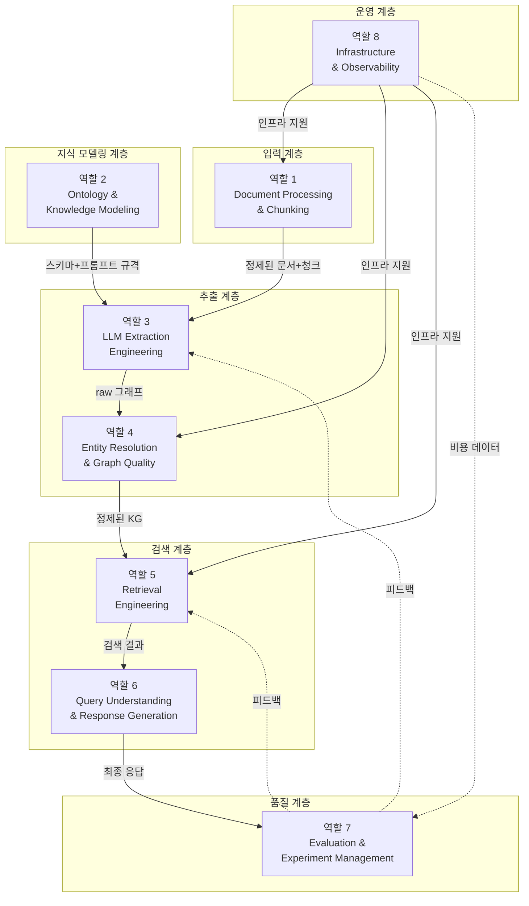
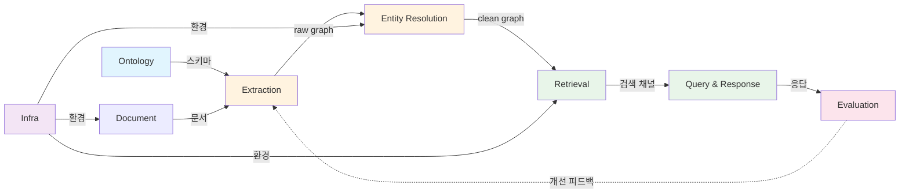
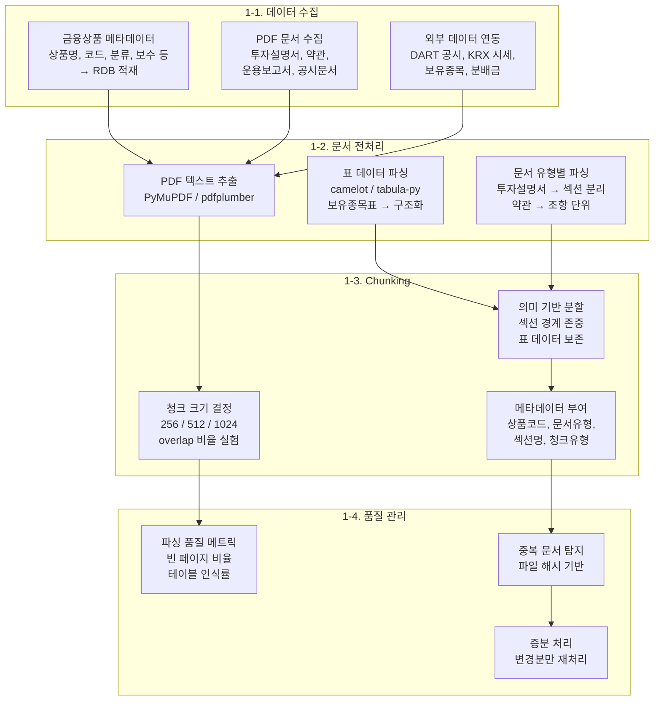
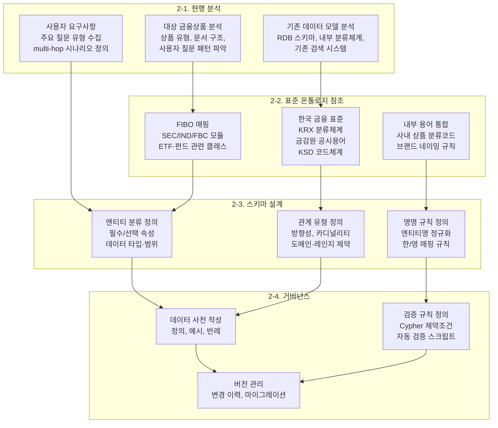
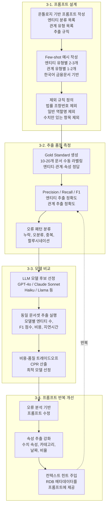
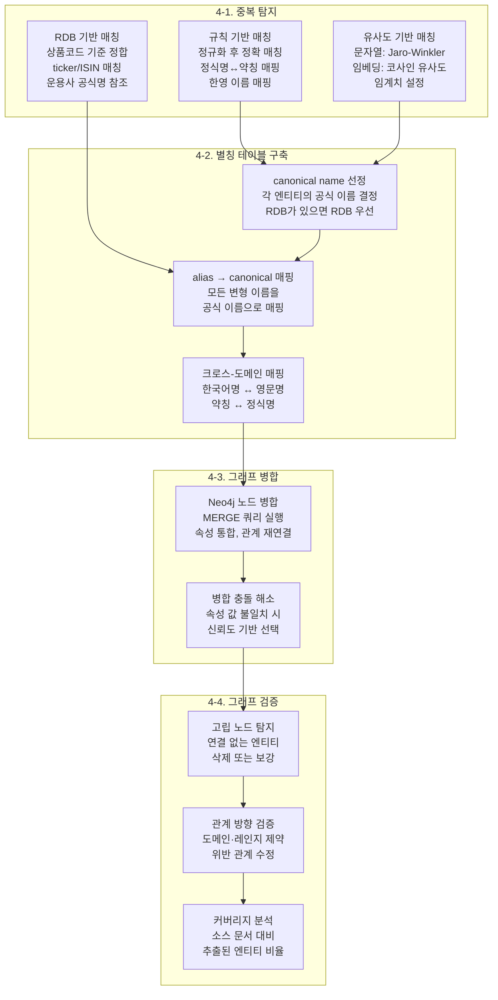
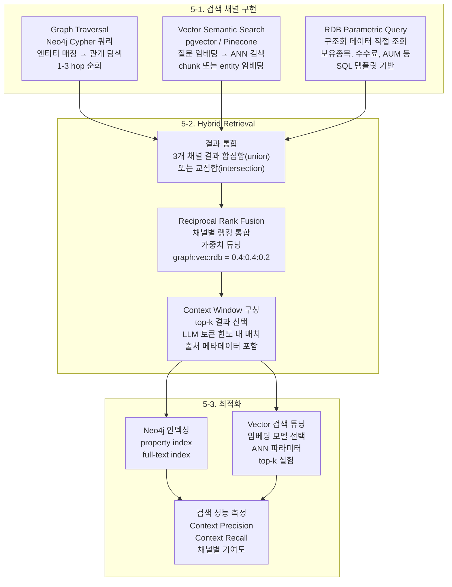
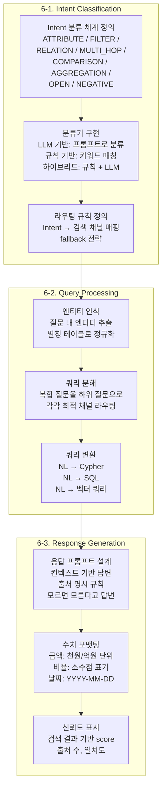
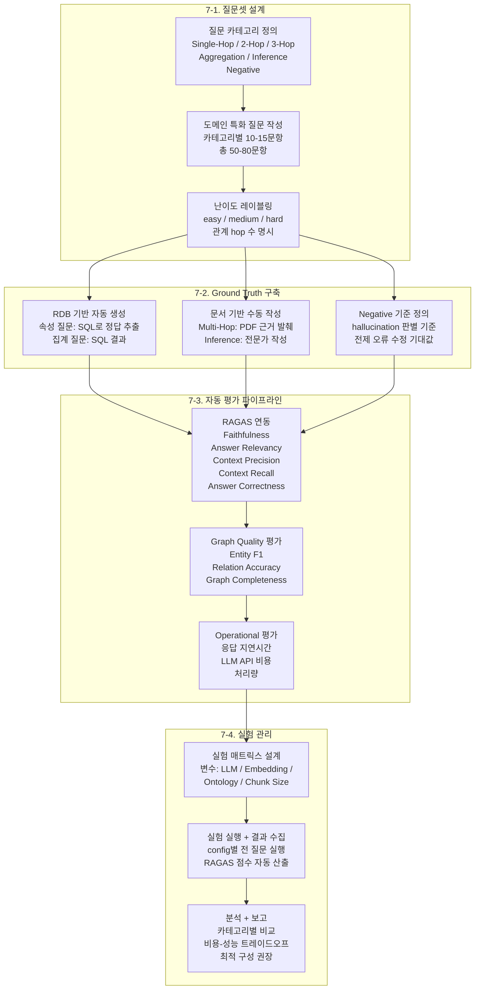
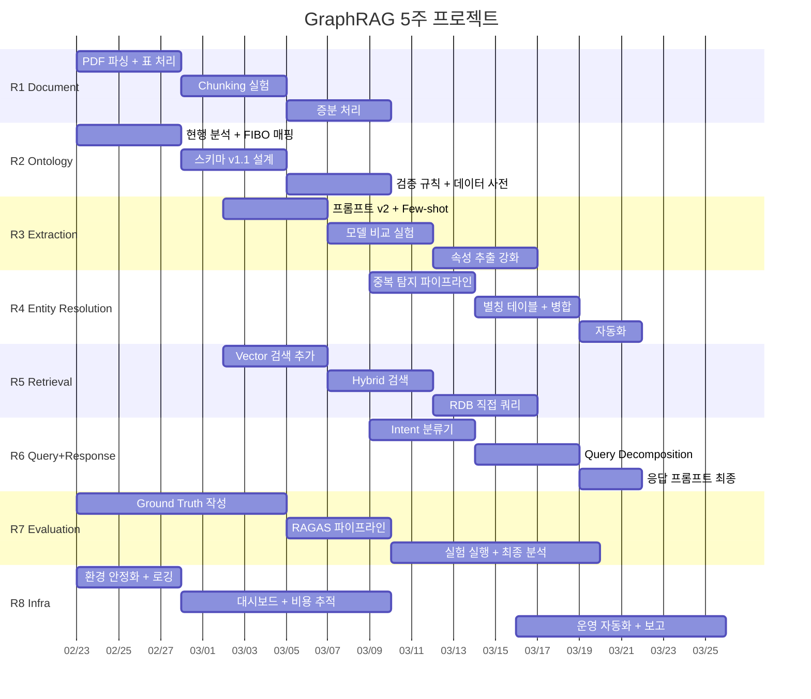

# 한국 증권사 금융상품 GraphRAG 구축 — 역할별 작업 가이드

## 개요

이 문서는 한국 증권사의 금융상품(ETF, 펀드, ELS 등)을 대상으로 GraphRAG 시스템을
구축할 때 필요한 역할 분담과 작업 가이드를 제공합니다.

GraphRAG(Graph-based Retrieval Augmented Generation)는 Knowledge Graph와
Vector Search를 결합하여, 단순 키워드 검색이나 벡터 유사도 검색만으로는 불가능한
**multi-hop 관계 추론**을 가능하게 하는 아키텍처입니다.

### 일반 RAG vs GraphRAG

```
일반 RAG:
  질문 → 벡터 검색 → 유사 문서 조각 → LLM 응답
  한계: "A가 투자하는 B의 섹터는?" 같은 관계 추론 불가

GraphRAG:
  질문 → [벡터 검색 + 그래프 탐색 + 구조화 쿼리] → 관계 기반 컨텍스트 → LLM 응답
  강점: Entity 간 관계를 따라가며 multi-hop 추론 가능
```

### 대상 도메인

- **금융상품**: ETF, 펀드, ELS/DLS, 채권 등
- **데이터 소스**: 투자설명서(PDF), 약관, 운용보고서, 상품 메타데이터(RDB), 공시정보
- **사용자 질문 예시**: "채권형 상품 중 환율위험이 있으면서 보수가 가장 낮은 것은?"

---

## 역할 구성 (8개)



### 역할 간 의존성 요약



**크리티컬 패스:**
```
Ontology(역할2) → Extraction(역할3) → Entity Resolution(역할4) → Retrieval(역할5) → Evaluation(역할7)
```

---

## 역할 1: Document Processing & Chunking

### 목적

원천 데이터(PDF, RDB, API)를 수집하고, LLM이 처리할 수 있는 형태의 문서 청크로 변환한다.
GraphRAG의 품질은 입력 문서의 품질에 직결된다.

### 작업 흐름



### 상세 가이드

#### 1-1. 한국 금융문서 특성

| 문서 유형 | 특성 | 파싱 전략 |
|----------|-----|---------|
| 투자설명서 | 50-200페이지, 섹션 구조, 표 다수 | 목차 기반 섹션 분리, 표 별도 파싱 |
| 간이투자설명서 | 5-20페이지, 요약 정보 | 전체 파싱 |
| 약관 | 조항 구조 (제1조, 제2조...) | 조항 단위 분리 |
| 운용보고서 | 정기 보고, 수치 데이터 중심 | 표 파싱 우선, 시계열 메타데이터 |
| 공시문서(DART) | 비정형, HTML/PDF 혼재 | 문서 유형 자동 분류 후 파싱 |

#### 1-2. 문서 유형별 파싱 전략

```python
# 투자설명서 섹션 분리 예시
PROSPECTUS_SECTIONS = [
    "집합투자기구의 개요",
    "집합투자기구의 투자정보",
    "투자위험",
    "매입·환매 등에 관한 사항",
    "보수 및 수수료",
    "기타 투자자 유의사항",
]

def parse_prospectus(pdf_path: str) -> list[Document]:
    """투자설명서를 섹션별로 분리하여 Document 리스트로 반환."""
    full_text = extract_text(pdf_path)
    sections = split_by_headers(full_text, PROSPECTUS_SECTIONS)
    documents = []
    for section_name, section_text in sections.items():
        doc = Document(
            text=section_text,
            metadata={
                "doc_type": "prospectus",
                "section": section_name,
                "source": pdf_path,
            },
        )
        documents.append(doc)
    return documents
```

#### 1-3. RDB → Document 변환

구조화된 RDB 데이터를 LLM이 처리할 수 있는 자연어 텍스트로 변환할 때, **관계를 명시적으로 표현**하는 것이 핵심이다.

```
나쁜 예 (단순 필드 나열):
  "상품명: ABC ETF\n벤치마크: KOSPI 200\n보수: 0.15%"

좋은 예 (관계 명시):
  "ABC ETF는 [운용사]가 운용하며, KOSPI 200 지수를 추적합니다.
   총보수는 0.15%이고, [거래소]에 상장되어 있습니다.
   주요 보유종목으로 삼성전자(25%), SK하이닉스(10%) 등이 있습니다."
```

#### 1-4. Chunking 실험 매트릭스

| chunk_size | overlap | 장점 | 단점 |
|-----------|---------|-----|------|
| 256 | 25 | 세밀한 엔티티 추출 | 문맥 손실, 비용 증가 |
| 512 | 50 | 균형 (권장 시작점) | - |
| 1024 | 100 | 문맥 유지, 비용 절감 | 엔티티 누락 가능 |

### 산출물

- 문서 유형별 파서 모듈
- Chunking 파라미터 실험 보고서
- 파싱 품질 자동 리포트 스크립트
- 증분 처리 파이프라인

---

## 역할 2: Ontology & Knowledge Modeling

### 목적

Knowledge Graph의 스키마를 설계한다. 어떤 엔티티를 추출하고, 어떤 관계로 연결할지를
정의하는 "설계도" 역할. 온톨로지 품질이 추출, 검색, 응답 품질 전체를 좌우한다.

### 작업 흐름



### 상세 가이드

#### 2-1. 한국 금융상품 도메인의 핵심 엔티티

| 엔티티 분류 | 설명 | 예시 |
|-----------|------|-----|
| **Financial Product** | 금융상품 (ETF, 펀드, ELS 등) | TIGER 미국S&P500, 삼성 코리아대표 |
| **Asset Management Company** | 자산운용사 / 집합투자업자 | 미래에셋자산운용, 삼성자산운용 |
| **Index** | 추적/참고 지수 | S&P 500, KOSPI 200 |
| **Stock** | 개별 종목 | 삼성전자, Apple, NVIDIA |
| **Bond** | 채권 | 국고채 3년, US Treasury |
| **Exchange** | 거래소 | 한국거래소(KRX), NYSE |
| **Regulatory Body** | 규제/감독 기관 | 금융위원회, 금융감독원 |
| **Regulation** | 법률/규정 | 자본시장법, 예금자보호법 |
| **Trustee** | 수탁회사 / 신탁업자 | 한국씨티은행, HSBC |
| **Custodian** | 자산보관회사 | (Trustee와 역할 구분) |
| **Distributor** | 판매회사 | 증권사, 은행 (판매 역할) |
| **Sector** | 업종/섹터 | 반도체, IT, 에너지, 헬스케어 |
| **Country** | 투자 국가/지역 | 미국, 한국, 중국, 일본 |
| **Risk Factor** | 위험 요소 | 시장위험, 환율위험, 신용위험 |
| **Fee** | 수수료/보수 | 총보수 0.07%, 판매수수료 |
| **Investment Strategy** | 투자 전략 | 패시브, 액티브, 커버드콜, 레버리지 |
| **Asset Class** | 자산군 | 주식, 채권, 원자재, 대체투자 |
| **Currency** | 통화 | KRW, USD, CNY, JPY |
| **Category** | 상품 분류 | 국내주식형, 해외채권형 (KRX 분류) |
| **Distribution** | 분배금/배당 | 분기배당, 월배당 |
| **Derivative** | 파생상품 | Swap, Option, Futures |
| **Person** | 인물 | 펀드매니저 |
| **Document** | 문서 유형 | 투자설명서, 약관, 운용보고서 |

#### 2-2. 핵심 관계 유형

| 관계 | From → To | 설명 |
|-----|----------|------|
| MANAGES | 운용사 → 상품 | 운용 관계 |
| TRACKS | 상품 → 지수 | 지수 추적 |
| INVESTS_IN | 상품 → 종목/자산 | 투자 대상 |
| HOLDS | 상품 → 종목 | 보유종목 (비중 속성 포함) |
| LISTED_ON | 상품 → 거래소 | 상장 |
| HAS_RISK | 상품 → 위험요소 | 위험 보유 |
| HAS_FEE | 상품 → 수수료 | 보수/수수료 |
| HAS_CATEGORY | 상품 → 분류 | KRX 분류 |
| USES_STRATEGY | 상품 → 전략 | 투자 전략 |
| DENOMINATED_IN | 상품 → 통화 | 표시 통화 |
| HEDGES_AGAINST | 상품 → 통화 | 환헤지 대상 |
| BELONGS_TO_SECTOR | 종목 → 섹터 | 섹터 분류 |
| COMPONENT_OF | 종목 → 지수 | 지수 구성종목 |
| REGULATED_BY | 상품 → 감독기관 | 규제 |
| GOVERNED_BY | 상품 → 법률 | 적용 법규 |
| TRUSTEED_BY | 상품 → 수탁사 | 수탁 |
| DISTRIBUTED_BY | 상품 → 판매사 | 판매 |
| LOCATED_IN | 엔티티 → 국가 | 소재지/투자지역 |
| ISSUED_BY | 채권 → 발행자 | 발행 |
| SUBSIDIARY_OF | 기관 → 기관 | 자회사 |

#### 2-3. FIBO(Financial Industry Business Ontology) 활용

FIBO는 EDM Council이 관리하는 금융산업 표준 온톨로지(OWL/RDF).
전체를 도입하면 과도하게 복잡하므로, **ETF/펀드 관련 서브셋만 참조**한다.

| FIBO 모듈 | 해당 개념 | 활용 방법 |
|----------|---------|---------|
| FND (Foundations) | 법인, 조직, 계약 | 운용사, 수탁사 등의 관계 모델 참조 |
| SEC (Securities) | 증권, 펀드, ETF | 상품 분류 체계와 속성 참조 |
| IND (Indices) | 지수, 벤치마크 | 지수-구성종목 관계 모델 참조 |
| FBC (Business & Commerce) | 거래소, 규제 | 시장 인프라 관계 참조 |

**FIBO 도입 시 주의:**
- FIBO URI는 LLM 프롬프트에 부적합 → 자연어 레이블 사용
- FIBO는 미국/유럽 중심 → 한국 금융 특수성(금감원, KRX, 자본시장법) 별도 매핑 필요
- 구조적 골격만 차용하고 실제 레이블은 내부 용어 사용 권장

#### 2-4. 한국 금융 표준 용어

| 소스 | 활용 내용 |
|-----|---------|
| KRX 분류체계 | 국내주식형/해외주식형/채권형/원자재 등 → Category 엔티티 |
| 금감원 공시용어 | 집합투자업자, 신탁업자, 일반사무관리회사 → 엔티티 분류 |
| KSD 코드체계 | 펀드코드(KSD Fund Code) → 상품 식별자 |
| 사내 분류코드 | 브랜드 네이밍, 내부 상품코드 → 정규화 규칙 |

#### 2-5. 온톨로지 검증

```cypher
-- 미분류 엔티티 탐지
MATCH (e:__Entity__)
WHERE e.classification IS NULL OR e.classification = ''
RETURN count(e) AS unclassified

-- 정의되지 않은 관계 유형 탐지
MATCH ()-[r]->()
WHERE NOT type(r) STARTS WITH '__'
  AND NOT type(r) IN $DEFINED_RELATIONSHIP_TYPES
RETURN type(r), count(*) AS unexpected

-- 관계 방향 검증 (상품→지수 = TRACKS, 역방향은 오류)
MATCH (idx {classification:'Index'})-[:TRACKS]->(prod {classification:'Financial Product'})
RETURN count(*) AS reversed_tracks  -- 0이어야 정상
```

### 산출물

- 엔티티 분류 체계 (엔티티별 필수/선택 속성, 데이터 타입)
- 관계 유형 정의서 (방향, 카디널리티, 도메인/레인지)
- FIBO 매핑표
- 한국 금융 표준 용어 매핑표
- 데이터 사전 (정의, 예시, 반례)
- Cypher 검증 쿼리 셋
- 온톨로지 버전 관리 체계

---

## 역할 3: LLM Extraction Engineering

### 목적

LLM을 활용하여 문서 청크에서 엔티티, 관계, 속성을 추출한다.
프롬프트 품질이 그래프 품질을 결정하고, 그래프 품질이 검색 품질을 결정하므로
GraphRAG 전체 파이프라인의 핵심 병목이다.

### 작업 흐름



### 상세 가이드

#### 3-1. 추출 프롬프트 구조

효과적인 추출 프롬프트는 다음 4개 블록으로 구성된다:

```
[블록 1: 역할 및 목표]
  "You are a financial knowledge graph extraction expert.
   Extract entities, relationships, and attributes from
   Korean financial product documents."

[블록 2: 온톨로지 규격]
  - 허용 엔티티 분류 목록 (역할 2에서 정의)
  - 허용 관계 유형 목록
  - 속성 추출 규칙

[블록 3: Few-shot 예시] ← 가장 중요
  - 실제 한국어 금융문서에서 발췌한 입력/출력 쌍
  - 엔티티 유형별 2-3개, 관계 유형별 1-2개

[블록 4: 제외 규칙 및 출력 형식]
  - 추출하지 말 것: 법률 조항번호, 일반 역할명, 문서 구조 요소
  - 출력 포맷 (JSON / 구조화 텍스트)
```

#### 3-2. Few-shot 예시가 중요한 이유

규칙만 나열한 프롬프트 vs Few-shot이 포함된 프롬프트의 차이:

| 항목 | 규칙만 | 규칙 + Few-shot |
|-----|-------|----------------|
| Entity Recall | 40-60% | 70-85% |
| 한국어 엔티티 정규화 | 불안정 | 안정적 |
| 속성 추출 | 거의 안 됨 | 60%+ |
| 프롬프트 토큰 수 | 적음 | 1.5-2배 |

**Few-shot 예시 작성 원칙:**
1. **실제 데이터에서 발췌** — 가상 예시보다 실제 문서 기반이 효과적
2. **에지 케이스 포함** — 쉬운 것만이 아니라 한/영 혼용, 긴 정식명 등 포함
3. **정규화 기대값 명시** — "미래에셋TIGER미국S&P500증권상장지수투자신탁" → "TIGER 미국S&P500"

#### 3-3. 추출 품질 측정

| 메트릭 | 측정 방법 | 목표치 |
|-------|---------|-------|
| Entity Precision | 추출된 엔티티 중 정답인 비율 | >0.85 |
| Entity Recall | 정답 엔티티 중 추출된 비율 | >0.70 |
| Relation Accuracy | 추출된 관계 100개 샘플 중 정확한 비율 | >0.80 |
| Attribute Coverage | RDB 속성 중 그래프에 반영된 비율 | >0.60 |
| Classification Accuracy | 엔티티 분류가 올바른 비율 | >0.90 |

#### 3-4. 한국어 금융문서 특수 고려사항

| 문제 | 예시 | 해결 방법 |
|-----|------|---------|
| 정식명 vs 약칭 | "미래에셋TIGER미국S&P500증권상장지수투자신탁(주식)" vs "TIGER 미국S&P500" | 프롬프트에 정규화 규칙 + 예시 |
| 한영 혼용 | "S&P500", "KOSPI", "나스닥" | 통일 규칙 (한글 우선 또는 영문 우선) |
| 수치+단위 | "총보수 연 0.07%", "순자산총액 5조원" | 속성으로 추출 (수치와 단위 분리) |
| 법률 용어 | "자본시장과 금융투자업에 관한 법률" | Regulation 엔티티로 추출 |
| 조직 약칭 | "금위", "금감원" | 별칭 매핑 테이블 |

### 산출물

- 추출 프롬프트 (버전 관리)
- Few-shot 예시 셋 (엔티티 유형별 + 관계 유형별)
- Gold Standard 라벨링 데이터 (10-20 문서)
- 모델 비교 실험 보고서 (F1, 비용, 지연시간)
- 오류 패턴 분석서

---

## 역할 4: Entity Resolution & Graph Quality

### 목적

LLM 추출은 문서 단위로 수행되므로, 같은 엔티티가 다른 이름으로 추출되어
그래프에 중복 노드가 생긴다. 이를 해소(Entity Resolution)하지 않으면
**그래프가 단절되어 multi-hop 추론이 불가능**해진다.

### 작업 흐름



### 상세 가이드

#### 4-1. 한국 금융상품의 Entity Resolution 난이도

금융상품명은 특히 ER이 어렵다. 같은 상품이 다양한 이름으로 등장:

```
1. 정식명:  "미래에셋TIGER미국S&P500증권상장지수투자신탁(주식)"
2. 브랜드명: "TIGER 미국S&P500 ETF"
3. 약칭:    "TIGER 미국S&P500"
4. 코드:    "360750" (ticker) / "KR7360750004" (ISIN)
5. 영문:    "TIGER US S&P500 ETF"
```

→ 이 5가지가 **모두 같은 노드**여야 multi-hop 질문에 답할 수 있다.

#### 4-2. 3단계 Entity Resolution 파이프라인

```
Phase 1: RDB 기반 확정 매칭 (높은 신뢰도)
  - RDB에 공식명(name_ko), ticker, ISIN이 있으면 이를 canonical로
  - 투자설명서의 정식명칭을 RDB 공식명으로 매핑
  - 자동 병합 가능

Phase 2: 규칙 기반 정규화 (중간 신뢰도)
  - "증권상장지수투자신탁.*$" 접미사 제거
  - "^미래에셋|^삼성|^KB" 브랜드 접두사 정규화
  - "(주식)|(채권혼합)|(합성)" 펀드 유형 접미사 제거
  - 정규화 후 일치하면 자동 병합

Phase 3: 유사도 기반 후보 탐색 (낮은 신뢰도)
  - Jaro-Winkler 유사도 > 0.85인 쌍 탐색
  - 임베딩 코사인 유사도 > 0.90인 쌍 탐색
  - 사람이 확인 후 병합 (semi-automatic)
```

#### 4-3. 그래프 품질 메트릭

| 메트릭 | Cypher 쿼리 예시 | 목표 |
|-------|----------------|-----|
| 고립 노드 비율 | `MATCH (e:__Entity__) WHERE NOT (e)--() RETURN count(e)` | <5% |
| 엔티티당 평균 관계 수 | `MATCH (e)-[r]-() RETURN avg(count(r))` | >3 |
| 소스 커버리지 | 엔티티가 추출된 소스 문서 비율 | >80% |
| 중복 후보 수 | 유사도 기반 중복 쌍 수 | 0 (병합 완료) |
| 분류 누락 비율 | classification IS NULL인 엔티티 비율 | <3% |

### 산출물

- Entity Resolution 파이프라인 코드 (규칙 + 유사도 + RDB)
- 별칭 테이블 (alias → canonical 매핑)
- 그래프 검증 스크립트 (Cypher 쿼리 셋)
- 그래프 품질 리포트 (자동 생성)

---

## 역할 5: Retrieval Engineering

### 목적

사용자 질문에 대해 Knowledge Graph, Vector Store, RDB에서 관련 정보를 검색하고
통합 랭킹하여 LLM에 전달할 컨텍스트를 구성한다. **GraphRAG의 차별점은
단일 검색이 아닌 Hybrid Retrieval**에 있다.

### 작업 흐름



### 상세 가이드

#### 5-1. 3-Channel Hybrid Retrieval 아키텍처

```
질문 입력
  ↓
┌─────────────────────────────────────────────┐
│              Query Router                   │
│  (역할 6의 Intent Classifier 결과 활용)       │
├──────────────┬──────────────┬───────────────┤
│  STRUCTURED  │   SEMANTIC   │     GRAPH     │
│  (수치/필터)  │  (서술형)     │  (관계 추론)   │
├──────────────┼──────────────┼───────────────┤
│   RDB SQL    │ Vector ANN   │ Neo4j         │
│   Query      │ Search       │ Traversal     │
├──────────────┴──────────────┴───────────────┤
│          Reciprocal Rank Fusion             │
├─────────────────────────────────────────────┤
│          Context Assembly                   │
│    (top-k → LLM prompt 구성)                │
└─────────────────────────────────────────────┘
  ↓
LLM Response Generation (역할 6)
```

#### 5-2. 각 채널의 강점과 적합한 질문 유형

| 채널 | 강점 | 적합한 질문 | 한계 |
|-----|------|-----------|-----|
| **Graph Traversal** | 관계 기반 추론, multi-hop | "A가 운용하는 상품의 벤치마크는?" | 엔티티명 정확 매칭 필요 |
| **Vector Search** | 의미적 유사성, 서술형 정보 | "투자위험에 대해 알려주세요" | 구조화 데이터 약함 |
| **RDB Query** | 정확한 수치, 필터링, 집계 | "보수가 가장 낮은 채권형 상품은?" | 비정형 정보 없음 |

#### 5-3. RDB 직접 쿼리 채널이 필요한 이유

금융상품 데이터는 **RDB에 이미 구조화되어 있는 경우가 많다**.
이를 텍스트로 변환하여 그래프에 넣으면 정확도가 떨어진다.

```
질문: "보수가 0.1% 이하인 채권형 ETF는?"

RDB 직접 쿼리:  정확한 결과 (SQL WHERE 조건)
그래프 검색:     Fee 노드의 속성값 비교 → 추출 품질에 의존
벡터 검색:      "0.1%"라는 수치 매칭 어려움
```

→ 구조화 질문은 RDB 채널이 가장 정확하다.

#### 5-4. Reciprocal Rank Fusion (RRF)

여러 검색 채널의 결과를 통합하는 랭킹 알고리즘:

```python
def reciprocal_rank_fusion(
    ranked_lists: list[list[str]],  # 채널별 결과 리스트
    weights: list[float],           # 채널별 가중치
    k: int = 60,                    # RRF 상수
) -> list[tuple[str, float]]:
    scores: dict[str, float] = {}
    for ranked_list, weight in zip(ranked_lists, weights):
        for rank, doc_id in enumerate(ranked_list):
            scores[doc_id] = scores.get(doc_id, 0) + weight / (k + rank + 1)
    return sorted(scores.items(), key=lambda x: x[1], reverse=True)
```

### 산출물

- Hybrid Retriever 모듈 (Graph + Vector + RDB)
- RRF 랭킹 구현 + 가중치 튜닝 결과
- RDB 쿼리 템플릿 셋
- Neo4j 인덱스 설정 스크립트
- 채널별 검색 성능 비교 보고서

---

## 역할 6: Query Understanding & Response Generation

### 목적

사용자의 자연어 질문을 분석하여 **어떤 검색 채널을 사용할지 결정**(Intent Classification)하고,
검색 결과를 바탕으로 정확하고 신뢰할 수 있는 응답을 생성한다.

### 작업 흐름



### 상세 가이드

#### 6-1. Intent 분류 체계

| Intent | 설명 | 예시 질문 | 우선 검색 채널 |
|--------|------|---------|-------------|
| **ATTRIBUTE** | 특정 상품의 속성 조회 | "A 상품의 총보수는?" | RDB |
| **FILTER** | 조건 기반 목록 | "채권형 상품은?" | RDB + Graph |
| **RELATION** | 엔티티 간 관계 | "수탁회사는 어디?" | Graph |
| **MULTI_HOP** | 2-3단계 관계 추론 | "A 보유종목의 섹터는?" | Graph 필수 |
| **COMPARISON** | 복수 엔티티 비교 | "A vs B 차이점?" | Graph + RDB |
| **AGGREGATION** | 집계/통계 | "섹터별 상품 수?" | RDB |
| **OPEN** | 서술형/의견 | "투자위험은?" | Vector + Graph |
| **NEGATIVE** | 없는 정보 요청 | "비트코인 ETF?" | 전체 → 부재 확인 |

#### 6-2. 쿼리 분해 (Query Decomposition)

GraphRAG의 핵심 기능. 복합 질문을 단계별 하위 질문으로 나눈다:

```
입력: "운용사 A가 운용하는 채권형 상품 중 보수가 가장 낮은 것의 보유종목은?"

분해:
  Sub-Q1: "운용사 A가 운용하는 상품 목록" → FILTER (Graph: MANAGES)
  Sub-Q2: "그 중 채권형 상품" → FILTER (RDB: category_l1 = '채권형')
  Sub-Q3: "보수가 가장 낮은 것" → AGGREGATION (RDB: ORDER BY fee ASC)
  Sub-Q4: "해당 상품의 보유종목" → ATTRIBUTE (RDB: holdings 테이블)

실행:
  1. Graph: (운용사A)-[MANAGES]->(상품들)
  2. RDB: 결과에서 category_l1 = '채권형' 필터
  3. RDB: 필터 결과에서 fee ASC LIMIT 1
  4. RDB: 해당 상품의 holdings 조회
  5. 결과 조합 → LLM 응답 생성
```

#### 6-3. 응답 생성 프롬프트 핵심 규칙

```
1. 컨텍스트에 없는 정보는 절대 생성하지 않는다 (anti-hallucination)
2. "정보를 찾을 수 없습니다"라고 명시적으로 답변한다
3. 모든 수치 데이터에 출처(문서명 또는 DB)를 명시한다
4. 금액은 읽기 쉬운 단위로 표기 (1,234,567,890원 → 약 12.3억원)
5. 투자 권유가 아님을 필요시 고지한다
```

### 산출물

- Intent 분류기 (LLM 기반 또는 하이브리드)
- 라우팅 규칙 매핑 테이블
- 쿼리 분해 엔진
- 응답 생성 프롬프트
- 수치 포맷팅 유틸리티

---

## 역할 7: Evaluation & Experiment Management

### 목적

GraphRAG 시스템의 품질을 체계적으로 측정하고, 실험 변수(LLM 모델, 임베딩 모델,
온톨로지, 청크 크기 등)를 변경하면서 최적 구성을 도출한다.

### 작업 흐름



### 상세 가이드

#### 7-1. 질문셋 카테고리와 목적

| 카테고리 | 문항 수 | 평가 대상 | GraphRAG 핵심 여부 |
|---------|--------|---------|-----------------|
| **Single-Hop** | 10-15 | 기본 검색 정확도 | 기본 (여기서 낮으면 추출 자체 문제) |
| **Multi-Hop 2** | 10-15 | 2단계 관계 추론 | 핵심 (Graph Traversal 효과) |
| **Multi-Hop 3** | 10 | 3단계 관계 추론 | 핵심 (GraphRAG vs 일반 RAG 차이 극대) |
| **Aggregation** | 8-10 | 전체 그래프 활용도 | RDB 채널 필요성 측정 |
| **Inference** | 7-10 | LLM 추론 능력 | Response LLM 성능 측정 |
| **Negative** | 5 | Hallucination 방지 | Faithfulness 측정 |

#### 7-2. RAGAS 메트릭 해석

| 메트릭 | 의미 | 낮을 때 원인 | 개선 방향 |
|-------|------|-----------|---------|
| **Faithfulness** | 답변이 컨텍스트에 충실한가 | Hallucination | 프롬프트에 "모르면 모른다" 강화 |
| **Context Precision** | 검색 컨텍스트가 관련 있는가 | 무관한 결과 혼입 | 임베딩 모델 변경, top-k 줄이기 |
| **Context Recall** | 필요한 정보를 가져왔는가 | 검색 누락 | 검색 채널 추가, graph depth 증가 |
| **Answer Relevancy** | 답변이 질문에 적합한가 | 동문서답 | Response LLM 개선 |
| **Answer Correctness** | 정답과 일치하는가 | 전체 파이프라인 | 추출+검색+생성 모두 점검 |

#### 7-3. 실험 비교 프레임워크

```
실험 변수 매트릭스:
├── Extraction LLM: Model A / Model B / Model C
├── Embedding Model: Cohere v3 / Titan v2 / OpenAI ada
├── Ontology Version: v1.0 (17 types) / v1.1 (25 types)
├── Chunk Size: 256 / 512 / 1024
└── Retrieval Mode: Graph only / Vector only / Hybrid

→ 한 번에 하나의 변수만 변경하여 영향 측정 (controlled experiment)
→ 각 실험을 최소 2-3회 반복하여 통계적 유의성 확보
```

#### 7-4. 비용-성능 비율 (CPR)

```
CPR = RAGAS_avg_score / total_cost_usd

예시:
  실험 A: RAGAS 0.85, 비용 $50 → CPR = 0.017
  실험 B: RAGAS 0.80, 비용 $10 → CPR = 0.080  ← 5배 효율적
```

### 산출물

- 평가 질문셋 YAML (카테고리별, 난이도별)
- Ground Truth 데이터 (질문별 정답 + 근거)
- RAGAS 자동 평가 스크립트
- 실험 결과 JSON (자동 저장)
- 카테고리별 비교 분석 보고서
- 최적 구성 권장 보고서

---

## 역할 8: Infrastructure & Observability

### 목적

GraphRAG 시스템의 인프라를 관리하고, 전체 파이프라인의 상태를 실시간 모니터링한다.
LLM API 비용 추적, 실험 재현성 확보, 운영 자동화가 핵심.

### 작업 흐름

```mermaid
flowchart TD
    subgraph "8-1. 인프라 관리"
        I1[Graph DB 운영<br/>Neo4j / Neptune<br/>인덱스, 백업, 복구]
        I2[Vector DB 운영<br/>pgvector / Pinecone<br/>임베딩 저장·검색]
        I3[RDB 운영<br/>PostgreSQL / Aurora<br/>스키마 마이그레이션]
        I4[컨테이너 관리<br/>Docker Compose / ECS<br/>환경 분리 dev/staging]
    end

    subgraph "8-2. 모니터링"
        I5[구조화 로깅<br/>JSON format (structlog)<br/>파이프라인 단계별]
        I6[메트릭 수집<br/>스크래핑 성공률<br/>추출 처리량<br/>쿼리 응답시간]
        I7[대시보드<br/>NeoDash: 그래프 통계<br/>운영: 파이프라인 상태<br/>실험: RAGAS 추이]
    end

    subgraph "8-3. 비용 추적"
        I8[LLM API 비용<br/>모델별 토큰 수<br/>입력/출력 구분<br/>실험별 집계]
        I9[Embedding 비용<br/>요청 수, 토큰 수<br/>모델별 단가]
        I10[인프라 비용<br/>컴퓨팅, 스토리지<br/>DB 인스턴스]
    end

    subgraph "8-4. 자동화"
        I11[파이프라인 오케스트레이션<br/>Airflow / Prefect / Step Functions<br/>스크래핑→추출→ER→평가]
        I12[실험 자동 실행<br/>config 입력 → 결과 JSON<br/>원클릭 파이프라인]
        I13[알림<br/>실험 완료, 비용 임계치,<br/>오류 발생 시 통보]
    end

    I1 --> I5
    I2 --> I5
    I3 --> I5
    I4 --> I6
    I5 --> I7
    I6 --> I7
    I8 --> I10
    I9 --> I10
    I10 --> I7
    I11 --> I12 --> I13
```

### 상세 가이드

#### 8-1. 비용 추적이 중요한 이유

GraphRAG는 인덱싱 시 대량의 LLM API 호출이 발생한다.
문서 수천 건 × 청크당 LLM 호출 → 비용이 빠르게 누적.

```
비용 추적 항목:
  인덱싱 비용 = (추출 LLM 입력 토큰 × 단가) + (출력 토큰 × 단가) + 임베딩 비용
  쿼리 비용   = (응답 LLM 입력 토큰 × 단가) + (출력 토큰 × 단가) + 임베딩 비용
  실험 총비용 = 인덱싱 비용 + (쿼리 비용 × 질문 수)
```

#### 8-2. NeoDash 대시보드 필수 패널

| 패널 | 유형 | 목적 |
|-----|------|-----|
| 엔티티 분류 분포 | 파이 차트 | 추출된 엔티티 유형 균형 확인 |
| 관계 유형 분포 | 바 차트 | 관계 추출 패턴 확인 |
| 상품별 연결 수 | 테이블 | 정보 풍부한/빈약한 상품 식별 |
| 그래프 탐색 뷰 | 그래프 | 특정 엔티티 주변 관계 시각화 |
| 고립 노드 수 | 숫자 | ER 작업 필요성 판단 |
| 실험별 RAGAS 점수 | 라인 차트 | 실험 간 성능 추이 |

### 산출물

- Docker/컨테이너 설정 및 운영 매뉴얼
- 구조화 로깅 설정
- NeoDash 대시보드 설정
- LLM 비용 추적 모듈
- 파이프라인 오케스트레이션 설정
- 실험 자동 실행 스크립트

---

## 5주 프로젝트 타임라인



### 주차별 마일스톤

| 주차 | 핵심 마일스톤 | 참여 역할 |
|-----|-------------|---------|
| **Week 1** | PDF 파싱 개선, 온톨로지 분석 완료, GT 작성 시작, 인프라 안정화 | R1, R2, R7, R8 |
| **Week 2** | 온톨로지 v1.1 확정, 프롬프트 v2, Vector 검색 추가, Chunking 최적화 | R1, R2, R3, R5, R7, R8 |
| **Week 3** | 모델 비교 완료, ER 파이프라인, Hybrid 검색, Intent 분류기, RAGAS 실행 | R3, R4, R5, R6, R7, R8 |
| **Week 4** | 속성 추출 강화, 노드 병합, RDB 쿼리, 쿼리 분해, 전체 실험 실행 | R3, R4, R5, R6, R7, R8 |
| **Week 5** | 증분 처리, ER 자동화, 응답 최종 버전, 최종 보고서, 운영 매뉴얼 | R1, R4, R6, R7, R8 |

---

## 팀 구성 권장안

8개 역할을 팀 규모에 따라 병합:

### 4인 팀

| 담당자 | 역할 조합 | 역할 성격 |
|-------|---------|---------|
| A | 역할 1 + 역할 8 | **데이터 엔지니어** — 문서 파싱 + 인프라 + 모니터링 |
| B | 역할 2 + 역할 4 | **지식 모델러** — 온톨로지 설계 + Entity Resolution |
| C | 역할 3 + 역할 6 | **LLM 엔지니어** — 추출 프롬프트 + 쿼리 이해 + 응답 생성 |
| D | 역할 5 + 역할 7 | **검색 엔지니어** — 검색 파이프라인 + 평가 + 실험 관리 |

### 6인 팀

| 담당자 | 역할 | 비고 |
|-------|-----|------|
| A | 역할 1 | PDF 파싱 + Chunking 전문 |
| B | 역할 2 + 4 | 온톨로지 + Entity Resolution (지식 그래프 품질 전담) |
| C | 역할 3 | LLM 추출 프롬프트 엔지니어 |
| D | 역할 5 + 6 | 검색 + 쿼리 이해 (검색 파이프라인 전담) |
| E | 역할 7 | 평가 + Ground Truth 작성 (도메인 지식 필요) |
| F | 역할 8 | 인프라 + 모니터링 + 비용 추적 |

### 8인 팀

각 역할에 1명씩 배정. 가장 이상적인 구성.

---

## 부록: 기술 스택 참고

| 레이어 | 선택지 | 비고 |
|-------|-------|-----|
| **Graph DB** | Neo4j, Amazon Neptune, NebulaGraph | Neo4j가 생태계 가장 풍부 |
| **Vector DB** | pgvector, Pinecone, Weaviate, Qdrant | pgvector는 PostgreSQL에 통합 |
| **RDB** | PostgreSQL, Amazon Aurora | 금융상품 메타데이터 저장 |
| **LLM** | Claude (Bedrock), GPT-4o, Llama | 추출 + 응답 생성 |
| **Embedding** | Cohere Multilingual, OpenAI ada, Titan | 다국어 지원 필수 (한국어) |
| **GraphRAG Framework** | LlamaIndex, LangChain, AWS GraphRAG Toolkit | 프로젝트 규모에 맞게 선택 |
| **Orchestration** | Airflow, Prefect, Step Functions | 파이프라인 자동화 |
| **Monitoring** | CloudWatch, Grafana, NeoDash | 그래프 시각화는 NeoDash |
| **Evaluation** | RAGAS, DeepEval | RAG 평가 프레임워크 |
