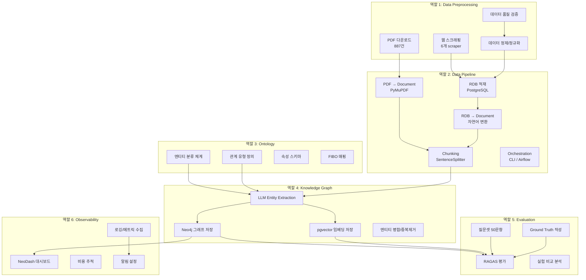
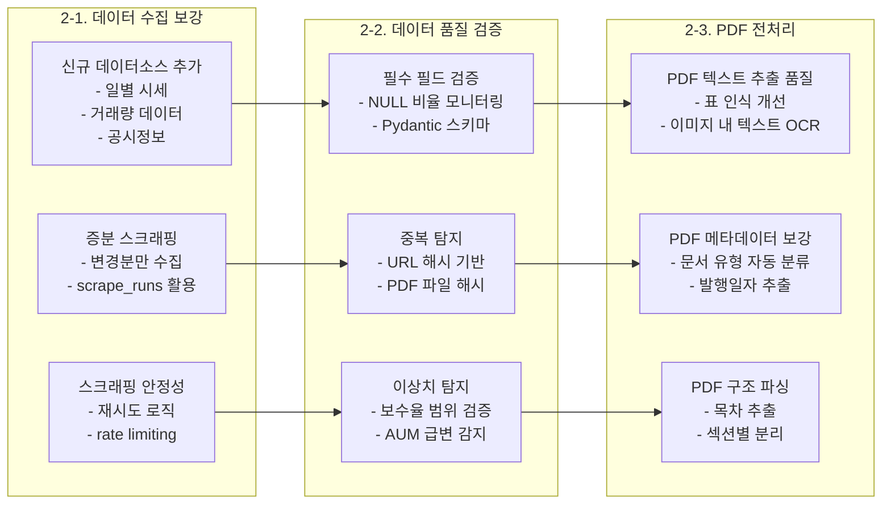
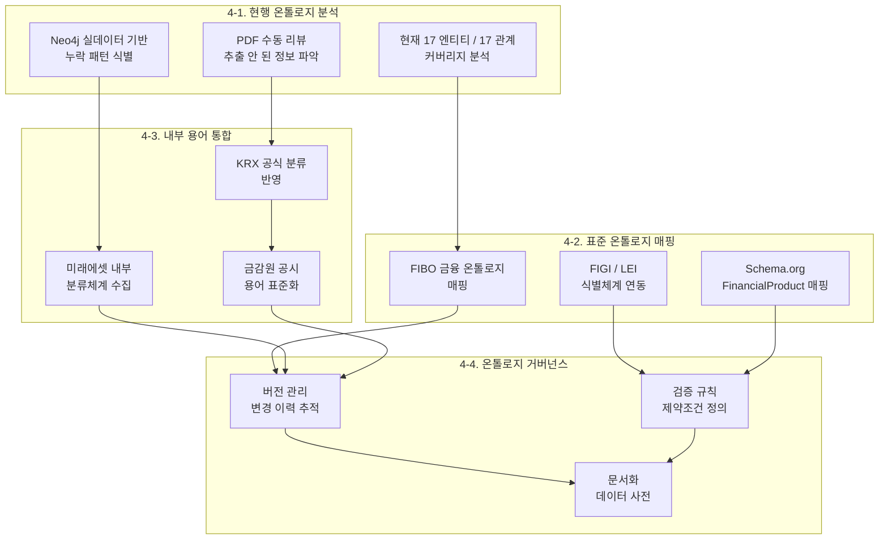
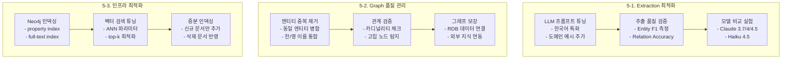
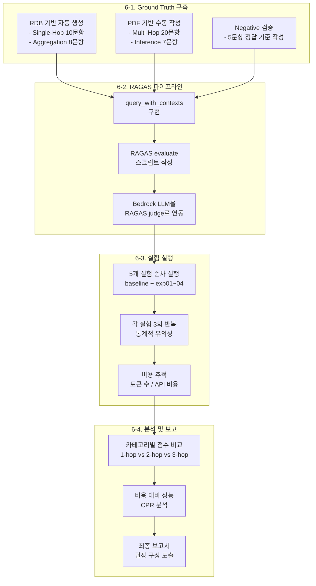
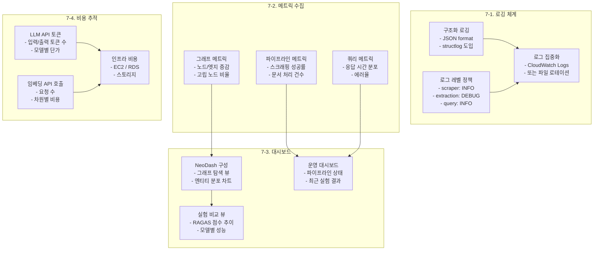
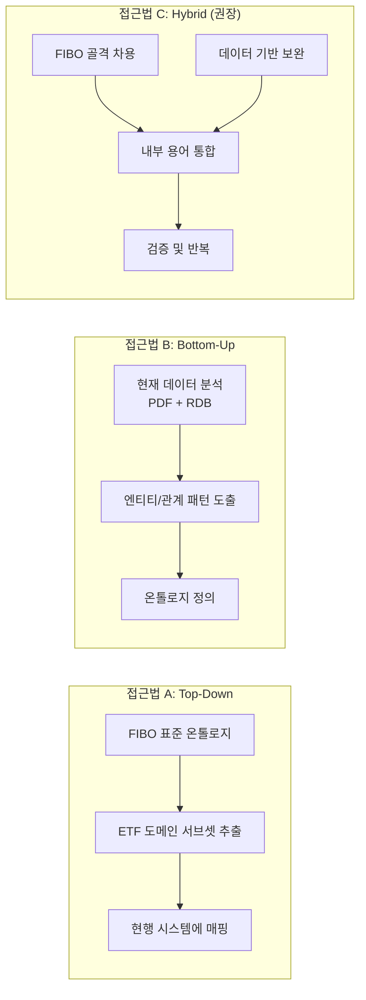
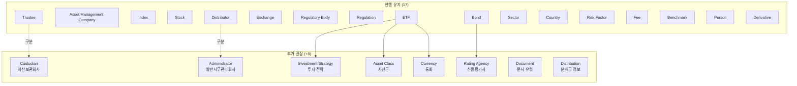

# TIGER ETF GraphRAG 프로젝트 — 역할별 작업 분담 가이드

## 목차

1. [프로젝트 전체 아키텍처](#1-프로젝트-전체-아키텍처)
2. [역할 1: Data Preprocessing](#2-역할-1-data-preprocessing)
3. [역할 2: Data Pipeline](#3-역할-2-data-pipeline)
4. [역할 3: Ontology 수립](#4-역할-3-ontology-수립)
5. [역할 4: Knowledge Graph 구축](#5-역할-4-knowledge-graph-구축)
6. [역할 5: Evaluation](#6-역할-5-evaluation)
7. [역할 6: Observability](#7-역할-6-observability)
8. [부록: Ontology 수립 상세 가이드](#8-부록-ontology-수립-상세-가이드)

---

## 1. 프로젝트 전체 아키텍처



### 현재 상태 요약

| 영역 | 구현 상태 | 주요 산출물 |
|-----|---------|-----------|
| Data Preprocessing | **80% 완료** | 6개 scraper, 221 상품, 887 PDF |
| Data Pipeline | **70% 완료** | CLI 17개 명령어, PDF/RDB 로더 |
| Ontology | **50% 완료** | 17 엔티티 타입, 17 관계 타입 |
| Knowledge Graph | **60% 완료** | 127K 노드, 748K 엣지 (50 PDF) |
| Evaluation | **30% 완료** | 질문셋 50개, baseline 1회 |
| Observability | **10% 완료** | 기본 로깅, NeoDash 컨테이너 |

---

## 2. 역할 1: Data Preprocessing

### 담당 범위

원천 데이터(웹사이트, PDF)를 수집하고 품질을 검증하여 파이프라인에 투입 가능한 상태로 만드는 것.

### 현재 구현 상태

```
src/tiger_etf/scrapers/
├── product_list.py      ✅ 221개 ETF 상품 목록 수집
├── product_detail.py    ✅ 상품 상세정보 (벤치마크, 보수, AUM 등)
├── holdings.py          ✅ 14,697건 보유종목 데이터
├── performance.py       ✅ 수익률 시계열
├── distribution.py      ✅ 분배금 이력
└── documents.py         ✅ 887건 PDF 다운로드 (투자설명서, 간이설명서, 약관)
```

### 작업 항목 상세



#### 2-1. 데이터 수집 보강

| 작업 | 설명 | 우선순위 |
|-----|------|---------|
| 증분 스크래핑 | `scrape_runs` 테이블의 마지막 실행 시점 이후 변경분만 수집. `EtfDocument.file_hash`를 활용하여 중복 다운로드 방지 | 높음 |
| 일별 시세 수집 | `etf_daily_prices` 테이블에 NAV, 시장가, 거래량 적재. 현재 스키마는 존재하나 scraper 미구현 | 중간 |
| 공시정보 연동 | 금융감독원 전자공시(DART) API 연동하여 수시공시, 영업보고서 등 추가 데이터소스 확보 | 낮음 |

#### 2-2. 데이터 품질 검증

**구현할 검증 규칙 예시:**

```python
# Pydantic 모델로 scraper 출력 검증
class ProductValidation(BaseModel):
    ticker: str = Field(min_length=6, max_length=6)
    name_ko: str = Field(min_length=5)
    total_expense_ratio: float = Field(ge=0, le=5.0)  # 0~5% 범위
    aum: Optional[int] = Field(ge=0)
    listing_date: date

class HoldingValidation(BaseModel):
    holding_name: str = Field(min_length=1)
    weight_pct: Optional[float] = Field(ge=0, le=100)
```

**품질 리포트 자동 생성:**

```sql
-- 필수 필드 NULL 비율
SELECT
    'benchmark_index' AS field,
    COUNT(*) FILTER (WHERE benchmark_index IS NULL) * 100.0 / COUNT(*) AS null_pct
FROM tiger_etf.etf_products;
```

#### 2-3. PDF 전처리 개선

| 현재 문제 | 해결 방안 | 파일 위치 |
|----------|---------|----------|
| 표(table) 데이터가 일반 텍스트로 추출됨 | `camelot` 또는 `tabula-py`로 표 별도 파싱 후 구조화 | `loader.py` |
| 스캔 PDF의 텍스트 누락 | `pytesseract` OCR 파이프라인 추가 | 신규 `ocr.py` |
| 문서 유형(투자설명서/약관)별 처리 부재 | 파일명의 `doc_type` 메타데이터 활용하여 섹션별 파싱 전략 분기 | `loader.py` |

---

## 3. 역할 2: Data Pipeline

### 담당 범위

데이터의 흐름을 관리하고, 수집 → 정제 → 적재 → 그래프 구축까지의 파이프라인을 안정적으로 운영하는 것.

### 현재 구현 상태

```
현재 파이프라인 (CLI 수동 실행):
  tiger-etf scrape products     → PostgreSQL (etf_products)
  tiger-etf scrape holdings     → PostgreSQL (etf_holdings)
  tiger-etf scrape documents    → data/pdfs/ + PostgreSQL (etf_documents)
  tiger-etf graphrag index-pdfs → Neo4j + pgvector
  tiger-etf graphrag index-rdb  → Neo4j + pgvector
```

### 작업 항목 상세



```mermaid
flowchart TD
    subgraph "3-1. 파이프라인 자동화"
        P1[Airflow DAG 설계<br/>또는 Prefect Flow]
        P2[스케줄 관리<br/>- 일별: 시세/NAV<br/>- 주별: 보유종목<br/>- 월별: PDF/문서]
        P3[의존성 관리<br/>- product_list → detail<br/>- detail → holdings<br/>- documents → index]
    end

    subgraph "3-2. 데이터 적재 개선"
        P4[Upsert 전략<br/>- ON CONFLICT DO UPDATE<br/>- 이력 관리]
        P5[배치 처리<br/>- 대량 INSERT 최적화<br/>- bulk copy]
        P6[트랜잭션 관리<br/>- 원자적 적재<br/>- rollback 처리]
    end

    subgraph "3-3. Document 변환"
        P7[Chunking 전략 실험<br/>- 256 / 512 / 1024<br/>- overlap 비율]
        P8[메타데이터 강화<br/>- 문서 유형별 태깅<br/>- 상품 코드 매핑]
        P9[RDB→Document 개선<br/>- 더 풍부한 자연어 변환<br/>- 관계 힌트 포함]
    end

    subgraph "3-4. 인프라"
        P10[Docker Compose 관리<br/>- Neo4j / pgvector<br/>- NeoDash]
        P11[백업/복구 전략<br/>- Neo4j dump<br/>- pg_dump]
        P12[환경별 설정<br/>- dev / staging / prod<br/>- .env 관리]
    end

    P1 --> P2 --> P3
    P4 --> P5 --> P6
    P7 --> P8 --> P9
    P10 --> P11 --> P12
```

#### 3-1. 파이프라인 자동화

**Airflow DAG 설계안:**

```python
# dags/tiger_etf_pipeline.py (예시)
from airflow import DAG
from airflow.operators.bash import BashOperator
from datetime import datetime, timedelta

default_args = {"retries": 2, "retry_delay": timedelta(minutes=5)}

with DAG("tiger_etf_daily", schedule="0 9 * * *", default_args=default_args):
    scrape_list = BashOperator(task_id="scrape_list", bash_command="tiger-etf scrape products")
    scrape_detail = BashOperator(task_id="scrape_detail", bash_command="tiger-etf scrape detail")
    scrape_holdings = BashOperator(task_id="scrape_holdings", bash_command="tiger-etf scrape holdings")
    scrape_docs = BashOperator(task_id="scrape_docs", bash_command="tiger-etf scrape documents")
    index_pdfs = BashOperator(task_id="index_pdfs", bash_command="tiger-etf graphrag index-pdfs")
    index_rdb = BashOperator(task_id="index_rdb", bash_command="tiger-etf graphrag index-rdb")

    scrape_list >> scrape_detail >> [scrape_holdings, scrape_docs]
    scrape_docs >> index_pdfs
    scrape_detail >> index_rdb
```

**실행 주기:**

| 데이터 유형 | 주기 | 이유 |
|-----------|------|-----|
| 상품 목록 | 주 1회 | 신규 상장/상장 폐지 빈도 낮음 |
| 보유종목 | 주 1회 | 포트폴리오 리밸런싱 주기 |
| PDF 문서 | 월 1회 | 투자설명서 개정 빈도 |
| 시세/NAV | 일 1회 | 매일 변동 |
| 분배금 | 월 1회 | 분배금 지급 주기 |

#### 3-2. Document 변환 개선

**현재 RDB→Document 변환(`loader.py:108`)의 문제점과 개선안:**

```
현재: 단순 필드 나열 ("ETF 상품명: XXX\n티커: XXX\n...")
개선: 관계를 명시적으로 표현하는 자연어로 변환

예시:
  현재: "ETF 상품명: TIGER 미국S&P500\n벤치마크 지수: S&P 500 TR"
  개선: "TIGER 미국S&P500 ETF는 미래에셋자산운용이 운용하며,
         S&P 500 Total Return 지수를 추적합니다.
         총보수는 0.07%이며, 한국거래소에 상장되어 있습니다.
         주요 보유종목으로 Apple(7.2%), Microsoft(6.8%), NVIDIA(6.1%) 등이 있습니다."
```

#### 3-3. Chunking 전략

| 파라미터 | 현재 값 | 실험 범위 | 영향 |
|---------|--------|----------|-----|
| `chunk_size` | 256 | 256 / 512 / 1024 | 작을수록 세밀, 클수록 문맥 유지 |
| `chunk_overlap` | 25 | 25 / 50 / 100 | 클수록 정보 손실 방지, 비용 증가 |

---

## 4. 역할 3: Ontology 수립

### 담당 범위

Knowledge Graph의 스키마를 설계하고 관리. 엔티티 분류, 관계 유형, 속성 체계를 정의하여 그래프 품질의 기반을 마련.

### 현재 구현 상태

**엔티티 분류 (17개, `indexer.py:17-35`):**
```
ETF, Asset Management Company, Index, Stock, Bond, Exchange,
Regulatory Body, Regulation, Trustee, Distributor, Sector,
Country, Risk Factor, Fee, Benchmark, Person, Derivative
```

**관계 유형 (17개, `indexer.py:74-91`):**
```
MANAGES, TRACKS, INVESTS_IN, LISTED_ON, REGULATED_BY,
DISTRIBUTED_BY, TRUSTEED_BY, BENCHMARKED_AGAINST,
BELONGS_TO_SECTOR, HAS_FEE, HAS_RISK, ISSUED_BY,
LOCATED_IN, HOLDS, COMPONENT_OF, GOVERNED_BY, SUBSIDIARY_OF
```

### 작업 항목 상세



> **상세 온톨로지 수립 가이드는 [8. 부록](#8-부록-ontology-수립-상세-가이드)에서 다룹니다.**

---

## 5. 역할 4: Knowledge Graph 구축

### 담당 범위

LLM 기반 엔티티/관계 추출, Neo4j 그래프 저장, pgvector 임베딩 저장, 그래프 품질 관리.

### 현재 구현 상태

```
Baseline (50 PDFs, Claude 3.7 Sonnet + Cohere v3):
  - 노드: 127,201개 (Entity 5,001 / Topic 13,869 / Statement 59,015 / Fact 34,433)
  - 엣지: 748,158개
  - 소스: 998 chunks (50 PDFs)
  - 인덱싱 시간: ~60분
```

### 작업 항목 상세



#### 5-1. Extraction 프롬프트 튜닝

현재 프롬프트(`indexer.py:40-196`)의 개선 포인트:

| 문제 | 원인 | 해결 방안 |
|-----|------|---------|
| 같은 엔티티가 다른 이름으로 추출 | "미래에셋TIGER미국S&P500" vs "TIGER 미국S&P500 ETF" | few-shot 예시에 정규화 규칙 추가 |
| 법률 조항이 엔티티로 추출 | "제93조", "제229조" 등 | 프롬프트에 제외 규칙 강화 (현재 있으나 불완전) |
| 수치 속성 누락 | 총보수, NAV, AUM 등이 attribute로 추출 안 됨 | attribute extraction 예시 보강 |

#### 5-2. 엔티티 중복 제거 (Entity Resolution)

```cypher
-- 유사 이름 엔티티 탐지 (Neo4j)
MATCH (e1:__Entity__), (e2:__Entity__)
WHERE e1 <> e2
  AND apoc.text.jaroWinklerDistance(e1.name, e2.name) > 0.85
RETURN e1.name, e2.name, apoc.text.jaroWinklerDistance(e1.name, e2.name) AS similarity
ORDER BY similarity DESC
LIMIT 50
```

**병합 전략:**
1. 정확 매칭: "미래에셋자산운용" = "미래에셋자산운용" → 자동 병합
2. 한/영 매칭: "NVIDIA" ↔ "엔비디아" → 별칭(alias) 테이블 관리
3. 약어 매칭: "S&P 500" ↔ "S&P500" ↔ "Standard & Poor's 500" → 정규화 규칙

#### 5-3. Neo4j 인덱싱

```cypher
-- 필수 인덱스 생성
CREATE INDEX entity_name_idx FOR (e:__Entity__) ON (e.name);
CREATE INDEX source_name_idx FOR (s:__Source__) ON (s.fileName);
CREATE INDEX chunk_text_idx FOR (c:__Chunk__) ON (c.text);

-- Full-text 검색 인덱스 (한국어 지원)
CREATE FULLTEXT INDEX entity_fulltext FOR (e:__Entity__) ON EACH [e.name, e.value];
```

---

## 6. 역할 5: Evaluation

### 담당 범위

GraphRAG 시스템의 성능을 체계적으로 측정하고, 실험 간 비교를 통해 최적 구성을 도출.

### 현재 구현 상태

```
완료:
  ✅ 질문셋 50문항 (6개 카테고리) - experiments/eval_questions.yaml
  ✅ 실험 프레임워크 - experiment.py (clear → index → metrics → eval)
  ✅ Baseline 1회 실행 (5문항만)
  ✅ 평가 방법론 문서 - EVALUATION_METHODOLOGY.md

미완료:
  ❌ Ground truth 작성 (50문항)
  ❌ RAGAS 파이프라인 구현
  ❌ query_with_contexts() 함수
  ❌ 실험 반복 실행 (통계적 유의성)
  ❌ 그래프 품질 평가 (Entity F1)
```

### 작업 항목 상세



#### 6-1. Ground Truth 생성 방법

**RDB 기반 자동 생성 (18문항):**

```python
# ground_truth_generator.py (예시)
def generate_single_hop_gt(session):
    """RDB에서 직접 정답을 추출하여 ground truth 생성."""
    ground_truths = {}

    # SH-01: 벤치마크 지수
    product = session.query(EtfProduct).filter(
        EtfProduct.name_ko.contains("미국S&P500")
    ).first()
    ground_truths["SH-01"] = f"TIGER 미국S&P500 ETF의 벤치마크 지수는 {product.benchmark_index}입니다."

    # SH-02: 총보수
    ground_truths["SH-02"] = f"TIGER 미국S&P500 ETF의 총보수는 {product.total_expense_ratio}%입니다."

    # AG-07: AUM 상위 5개
    top5 = session.query(EtfProduct).order_by(EtfProduct.aum.desc()).limit(5).all()
    ground_truths["AG-07"] = "순자산총액 기준 상위 5개: " + ", ".join(
        f"{p.name_ko} ({p.aum:,.0f}원)" for p in top5
    )
    return ground_truths
```

#### 6-2. RAGAS 메트릭 해석 가이드

| 메트릭 | 낮을 때 의미 | 개선 방향 |
|-------|------------|---------|
| **Faithfulness** < 0.7 | Hallucination 많음 | 프롬프트에 "모르면 모른다고 답변" 강화 |
| **Context Precision** < 0.5 | 관련 없는 컨텍스트가 많음 | 임베딩 모델 변경 / top-k 줄이기 |
| **Context Recall** < 0.5 | 필요한 컨텍스트를 못 가져옴 | chunk size 증가 / graph traversal depth 증가 |
| **Answer Relevancy** < 0.7 | 답변이 질문과 동떨어짐 | response LLM 변경 / 프롬프트 개선 |
| **Answer Correctness** < 0.5 | 정답과 불일치 | extraction + retrieval + generation 모두 점검 |

---

## 7. 역할 6: Observability

### 담당 범위

시스템 전체의 상태를 실시간으로 모니터링하고, 문제 발생 시 빠르게 진단할 수 있는 가시성 확보.

### 현재 구현 상태

```
완료:
  ✅ Python logging (기본 수준)
  ✅ scrape_runs 테이블 (스크래핑 이력)
  ✅ NeoDash 컨테이너 (포트 5005, 미설정)

미완료:
  ❌ 구조화된 로깅 (JSON format)
  ❌ 메트릭 수집 (Prometheus/CloudWatch)
  ❌ NeoDash 대시보드 구성
  ❌ 알림 체계
  ❌ LLM API 비용 추적
  ❌ 쿼리 성능 모니터링
```

### 작업 항목 상세



#### 7-1. 구조화 로깅

```python
# structlog 기반 로깅 예시
import structlog

logger = structlog.get_logger()

# 스크래핑 이벤트
logger.info("scrape_completed",
    scraper="holdings",
    items_processed=14697,
    items_failed=3,
    duration_seconds=45.2)

# 쿼리 이벤트
logger.info("query_executed",
    question="TIGER 미국S&P500 ETF의 벤치마크?",
    latency_seconds=10.12,
    context_count=5,
    response_length=450)

# 인덱싱 이벤트
logger.info("indexing_completed",
    pdf_count=50,
    nodes_created=127201,
    edges_created=748158,
    duration_minutes=62.3,
    llm_model="claude-3-7-sonnet")
```

#### 7-2. NeoDash 대시보드 구성

**필수 패널 목록:**

| 패널 | 유형 | Cypher 쿼리 |
|-----|------|------------|
| 엔티티 분류 분포 | 파이 차트 | `MATCH (e:__Entity__)-[:__SYS_RELATION__]->(c:__SYS_Class__) RETURN c.name, count(e)` |
| 관계 유형 분포 | 바 차트 | `MATCH ()-[r]->() WHERE NOT type(r) STARTS WITH '__' RETURN type(r), count(r)` |
| ETF별 연결 수 | 테이블 | `MATCH (e:__Entity__ {classification:'ETF'})-[r]-() RETURN e.name, count(r) ORDER BY count(r) DESC` |
| 그래프 탐색 | 그래프 뷰 | `MATCH p=(e:__Entity__)-[*1..2]-(n) WHERE e.name CONTAINS 'S&P500' RETURN p LIMIT 50` |
| 고립 노드 수 | 숫자 | `MATCH (e:__Entity__) WHERE NOT (e)--() RETURN count(e)` |

#### 7-3. LLM 비용 추적

```python
# 비용 추적 래퍼 (Bedrock용)
BEDROCK_PRICING = {
    "claude-3-7-sonnet": {"input": 3.00, "output": 15.00},  # per 1M tokens
    "claude-sonnet-4-5": {"input": 3.00, "output": 15.00},
    "claude-haiku-4-5":  {"input": 0.80, "output": 4.00},
}

class CostTracker:
    def __init__(self):
        self.total_input_tokens = 0
        self.total_output_tokens = 0
        self.model_id = ""

    def record(self, input_tokens: int, output_tokens: int, model: str):
        self.total_input_tokens += input_tokens
        self.total_output_tokens += output_tokens
        self.model_id = model

    @property
    def total_cost_usd(self) -> float:
        pricing = BEDROCK_PRICING.get(self.model_id, {})
        return (
            self.total_input_tokens * pricing.get("input", 0) / 1_000_000
            + self.total_output_tokens * pricing.get("output", 0) / 1_000_000
        )
```

---

## 8. 부록: Ontology 수립 상세 가이드

### 8.1 온톨로지 수립의 3가지 접근법



**권장: Hybrid 접근법 (C)**
- FIBO의 구조적 골격을 차용하되, 실제 데이터에서 도출된 패턴과 내부 용어를 결합

### 8.2 FIBO (Financial Industry Business Ontology) 활용

#### FIBO란?

EDM Council이 관리하는 금융산업 표준 온톨로지. OWL/RDF 기반으로 금융 개념 간의 관계를 정의.

#### FIBO 모듈 중 ETF 관련 영역

| FIBO 모듈 | 해당 개념 | 현행 매핑 |
|----------|---------|---------|
| **FND (Foundations)** | 법인, 조직, 계약 | Asset Management Company, Trustee, Distributor |
| **SEC (Securities)** | 증권, 펀드, ETF | ETF, Stock, Bond |
| **IND (Indices)** | 지수, 벤치마크 | Index, Benchmark |
| **FBC (Business & Commerce)** | 거래소, 규제기관 | Exchange, Regulatory Body |
| **BE (Business Entities)** | 법인 관계, 자회사 | SUBSIDIARY_OF |

#### FIBO → 현행 온톨로지 매핑 예시

```
FIBO                                    현행 시스템
────────────────────────────────────    ────────────────
fibo-sec:ExchangeTradedFund          →  ETF
fibo-sec:Equity                      →  Stock
fibo-sec:Bond                        →  Bond
fibo-fnd:FormalOrganization          →  Asset Management Company
fibo-ind:MarketIndex                 →  Index
fibo-fbc:Exchange                    →  Exchange
fibo-fbc:RegulatoryAgency            →  Regulatory Body
fibo-sec:hasIssuer                   →  ISSUED_BY
fibo-ind:isConstituentOf             →  COMPONENT_OF
fibo-sec:isListedOn                  →  LISTED_ON
fibo-sec:isManagedBy                 →  MANAGES (역방향)
fibo-sec:tracksIndex                 →  TRACKS
```

#### FIBO 도입 시 이점

1. **상호 운용성**: 다른 금융 시스템과의 데이터 교환이 용이
2. **완성도**: 이미 검증된 관계 모델을 활용하므로 누락 방지
3. **확장성**: 향후 다른 금융 상품(펀드, 선물 등)으로 확장 시 일관성 유지

#### FIBO 도입 시 주의점

1. **과도한 복잡성**: FIBO 전체는 수만 개 클래스. ETF 관련 서브셋만 추출 필요
2. **한국 금융 특수성**: FIBO는 미국/유럽 중심. 한국 규제 체계와 매핑 필요
3. **LLM 추출 호환성**: FIBO URI는 LLM 프롬프트에 부적합. 자연어 레이블 사용

### 8.3 한국 금융 표준 용어 체계

#### KRX(한국거래소) 분류 체계

```
KRX ETF 분류:
├── 국내주식형
│   ├── 시장대표
│   ├── 섹터/테마
│   └── 배당/가치
├── 국내채권형
├── 해외주식형
│   ├── 선진국
│   ├── 신흥국
│   └── 글로벌/테마
├── 해외채권형
├── 원자재
├── 통화
└── 혼합형/기타
```

**현행 시스템 반영 방법:**

현재 RDB의 `category_l1`, `category_l2`가 KRX 분류와 유사하나 명시적 매핑 없음.
온톨로지에 `CATEGORY` 엔티티 타입 추가 또는 ETF 엔티티의 속성으로 반영.

#### 금융감독원(FSS) 공시 용어

| FSS 용어 | 현행 온톨로지 매핑 | 비고 |
|---------|-----------------|-----|
| 집합투자업자 | Asset Management Company | 정확 |
| 신탁업자 | Trustee | 정확 |
| 일반사무관리회사 | (미반영) | **추가 필요** |
| 집합투자증권 | ETF | 상위 개념 |
| 투자설명서 | (문서 메타데이터) | doc_type='prospectus' |
| 간이투자설명서 | (문서 메타데이터) | doc_type='simple_prospectus' |
| 자산보관회사(custodian) | (미반영) | **Trustee와 구분 필요** |

### 8.4 미래에셋 내부 용어 통합

#### 수집 대상

| 소스 | 내용 | 온톨로지 반영 |
|-----|------|------------|
| TIGER 브랜드 상품 체계 | 상품명 네이밍 규칙 (TIGER + 지역 + 테마) | 엔티티 정규화 규칙 |
| 내부 상품 분류 코드 | KSD 펀드코드, 내부 분류 체계 | 속성(attribute)으로 반영 |
| 리서치 보고서 용어 | 섹터/업종 분류, 투자 전략 명칭 | Sector 엔티티 확장 |
| 컴플라이언스 용어 | 위험등급, 투자자 적합성 분류 | Risk Factor 세분화 |

#### 상품명 정규화 규칙

```python
# 미래에셋 TIGER ETF 상품명 패턴
TIGER_NAME_PATTERN = r"TIGER\s+(?P<region>[가-힣A-Z]+)?(?P<theme>[가-힣A-Za-z0-9&]+)(?P<strategy>커버드콜|액티브|레버리지|인버스)?"

# 예시:
# "TIGER 미국S&P500"          → region=미국, theme=S&P500, strategy=None
# "TIGER 미국배당다우존스타겟데일리커버드콜" → region=미국, theme=배당다우존스타겟데일리, strategy=커버드콜
# "TIGER 차이나AI소프트웨어"    → region=차이나, theme=AI소프트웨어, strategy=None
```

### 8.5 온톨로지 확장 제안

현행 17개 엔티티 타입에서 추가/세분화 권장 항목:



#### 추가 엔티티 상세

| 엔티티 | 필요성 | 예시 |
|-------|-------|-----|
| **Investment Strategy** | 커버드콜, 액티브, 패시브 등 전략이 현재 ETF 속성에 묻혀 있음 | 커버드콜, 타겟데일리, 레버리지, 인버스 |
| **Asset Class** | Bond/Stock보다 상위 분류 필요 | 주식, 채권, 원자재, 통화, 대체투자 |
| **Currency** | 환헤지 관련 분석에 별도 노드 필요 | USD, KRW, CNY, JPY |
| **Custodian** | Trustee(수탁회사)와 Custodian(자산보관)은 역할이 다름 | 한국씨티은행, HSBC |

#### 추가 관계 유형

| 관계 | 설명 | 예시 |
|-----|------|-----|
| **USES_STRATEGY** | ETF → Investment Strategy | TIGER NVDA-UST → 커버드콜 |
| **DENOMINATED_IN** | ETF → Currency | TIGER 미국S&P500 → USD |
| **HEDGES_AGAINST** | ETF → Currency | TIGER 미국S&P500(H) → USD |
| **CUSTODIED_BY** | ETF → Custodian | 자산 보관 관계 |
| **ADMINISTERED_BY** | ETF → Administrator | 사무관리 관계 |
| **DISTRIBUTES** | ETF → Distribution | 분배금 지급 관계 |

### 8.6 온톨로지 검증 방법

#### 정량 검증

```cypher
-- 1. 분류 커버리지: 모든 Entity가 classification을 가지는가?
MATCH (e:__Entity__)
WHERE e.classification IS NULL OR e.classification = ''
RETURN count(e) AS unclassified

-- 2. 관계 유효성: 정의된 관계 유형만 사용되는가?
MATCH ()-[r]->()
WHERE NOT type(r) STARTS WITH '__'
  AND NOT type(r) IN ['MANAGES','TRACKS','INVESTS_IN','LISTED_ON',
    'REGULATED_BY','DISTRIBUTED_BY','TRUSTEED_BY','BENCHMARKED_AGAINST',
    'BELONGS_TO_SECTOR','HAS_FEE','HAS_RISK','ISSUED_BY',
    'LOCATED_IN','HOLDS','COMPONENT_OF','GOVERNED_BY','SUBSIDIARY_OF']
RETURN type(r), count(*) AS unexpected_count

-- 3. 관계 방향 검증: ETF→Index는 TRACKS, 역방향은 없어야 함
MATCH (i:__Entity__ {classification:'Index'})-[:TRACKS]->(e:__Entity__ {classification:'ETF'})
RETURN count(*) AS reversed_tracks  -- 0이어야 정상
```

#### 정성 검증 (전문가 리뷰)

1. **도메인 전문가 리뷰**: ETF 운용팀 또는 컴플라이언스팀에 온톨로지 스키마 공유
2. **완전성 체크리스트**: 투자설명서의 주요 섹션별로 관련 엔티티/관계가 있는지 확인
3. **모호성 검토**: 동일 개념이 여러 엔티티로 표현되는 경우 식별

### 8.7 온톨로지 버전 관리

```yaml
# ontology/v1.0.yaml
version: "1.0"
date: "2026-02-19"
entity_types: 17
relationship_types: 17

# ontology/v1.1.yaml (계획)
version: "1.1"
date: "TBD"
changes:
  added_entities: [Investment Strategy, Asset Class, Currency, Custodian]
  added_relationships: [USES_STRATEGY, DENOMINATED_IN, HEDGES_AGAINST]
  modified: []
  removed: []
migration_notes: |
  v1.0 → v1.1 마이그레이션 시:
  - 기존 ETF 노드에서 전략 정보를 별도 노드로 분리
  - currency_hedge 속성을 HEDGES_AGAINST 관계로 변환
  - Trustee 중 custodian 역할을 Custodian으로 재분류
```
