# TIGER ETF GraphRAG — 전문가 관점 역할별 작업 분담 가이드 v2

## 개요

이 문서는 GraphRAG 시스템 구축 전문가 관점에서 5주간 프로젝트를 수행하기 위한
역할 분담과 주차별 작업 계획을 정의합니다.

### 현재 시스템 진단 요약

| 항목 | 현재 상태 | 목표 |
|-----|---------|-----|
| 검색 정확도 (5문항 기준) | ~20% (부분 정답 1건) | >80% |
| 응답 지연 | 10-15초 | <3초 |
| 엔티티 중복 제거 | 미구현 | <1% 중복 |
| 검색 방식 | Graph Traversal only | Hybrid (Vector + Graph + RDB) |
| 평가 체계 | 수동 5문항 | RAGAS 50문항 자동화 |
| RDB 구조화 데이터 활용 | 텍스트 변환 후 손실 | 직접 쿼리 병행 |

### 핵심 문제 진단

Baseline 결과를 분석하면 5개 질문 중 정확한 답변이 거의 없음:

- **SH-01 (보유종목)**: "정보를 찾을 수 없음" → RDB에 14,697건 보유종목이 있으나 그래프에서 검색 실패
- **SH-02 (투자위험)**: "추가 정보 필요" → PDF에 위험정보가 있으나 Risk Factor 엔티티로 추출 안 됨
- **SH-03 (채권형 ETF)**: 1개만 찾음 → MANAGES 관계 + 카테고리 필터링 실패
- **SH-04 (환율위험)**: 부분 정답 → 추론은 하나 HAS_RISK 관계 부재
- **SH-05 (반도체 섹터)**: NVDA-UST만 언급 → BELONGS_TO_SECTOR 관계 부재

**근본 원인**: 추출 품질, 엔티티 해소, 검색 전략 3가지가 모두 취약.

---

## 역할 구성 (8개 역할)

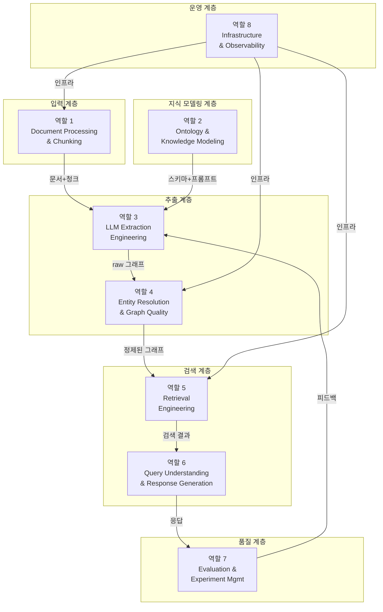

---

## 5주 타임라인 개요

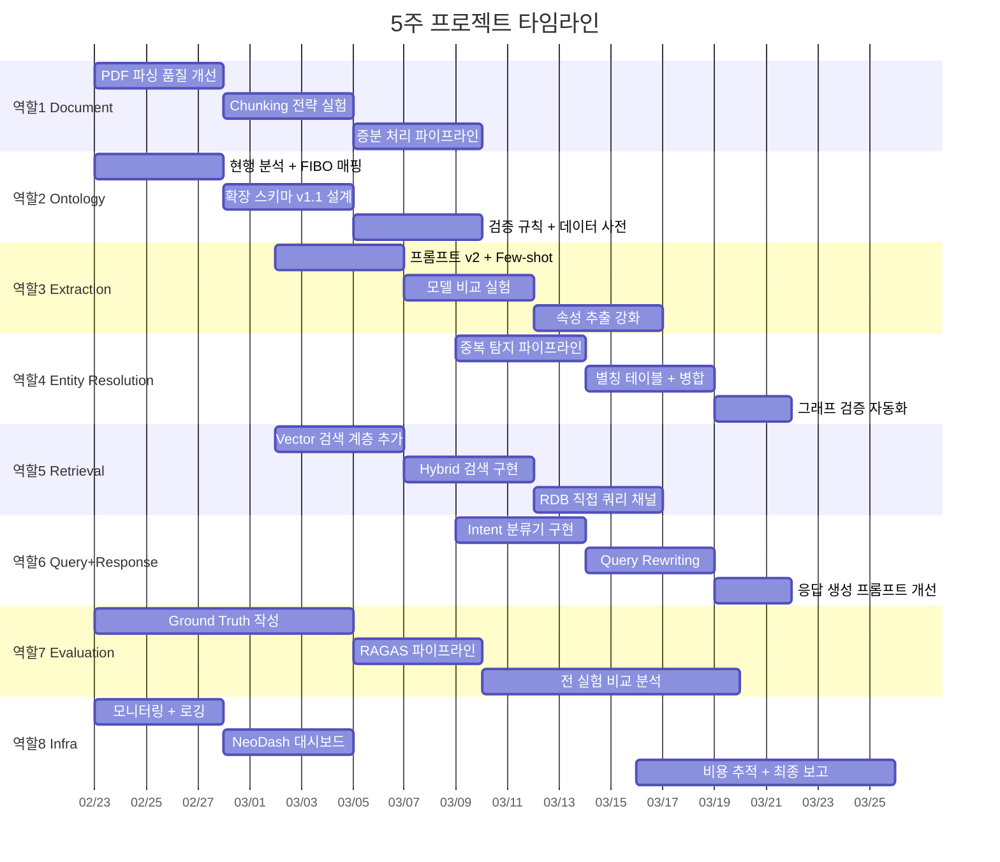

---

## 역할 1: Document Processing & Chunking

### 왜 별도 역할인가

GraphRAG의 품질은 입력 문서의 품질에 직결된다. "Garbage In, Garbage Out"이 가장
노골적으로 드러나는 영역. 현재 PDF 표(table) 데이터 손실, 문서 유형별 파싱 전략 부재,
chunking 파라미터 미최적화가 추출 품질 저하의 1차 원인.

### 담당 파일

```
src/tiger_etf/graphrag/loader.py        ← 핵심 수정 대상
src/tiger_etf/scrapers/documents.py     ← PDF 다운로드
data/pdfs/                               ← 887건 PDF
```

### 작업 상세

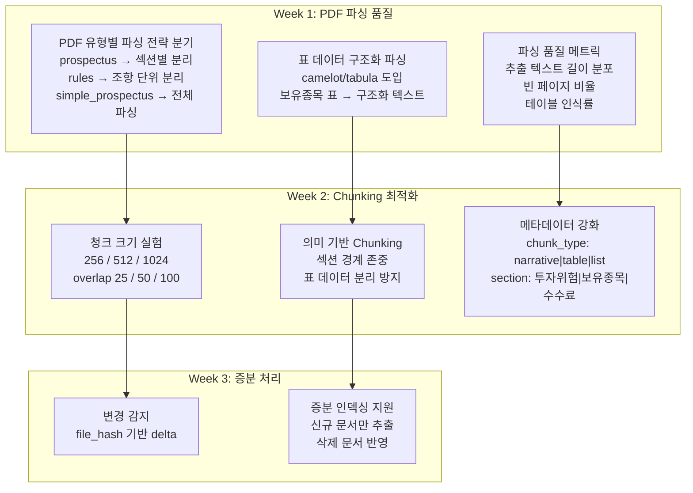

#### 핵심 산출물

| 산출물 | 설명 | 완료 기준 |
|-------|------|---------|
| `loader.py` 개선 | 문서 유형별 파싱 전략, 표 파싱, 메타데이터 강화 | 표 데이터 구조화 추출 성공률 >90% |
| Chunking 실험 보고서 | 3x3 파라미터 조합별 추출 품질 비교 | 최적 조합 선정 근거 제시 |
| 파싱 품질 대시보드 | PDF별 추출 통계 (텍스트 길이, 빈 페이지, 테이블 수) | 자동 리포트 생성 |

#### 구현 예시: 문서 유형별 파싱

```python
# loader.py 개선안
def load_pdfs(limit=None) -> list[Document]:
    for pdf_path in pdf_files:
        meta = _parse_pdf_filename(pdf_path, ticker_map)
        doc_type = meta.get("doc_type", "unknown")

        if doc_type == "prospectus":
            docs = _parse_prospectus(pdf_path, meta)  # 섹션별 분리
        elif doc_type == "rules":
            docs = _parse_rules(pdf_path, meta)        # 조항 단위
        else:
            docs = _parse_default(pdf_path, meta)       # 기본 파싱

        documents.extend(docs)

def _parse_prospectus(pdf_path, meta) -> list[Document]:
    """투자설명서를 주요 섹션별로 분리하여 각각 Document로 생성."""
    SECTIONS = [
        "투자위험", "보수 및 수수료", "주요 투자대상",
        "운용방법", "기타 투자자 유의사항"
    ]
    # 섹션 헤더를 기준으로 텍스트 분할
    # 각 섹션에 section_type 메타데이터 부여
    ...
```

---

## 역할 2: Ontology & Knowledge Modeling

### 왜 별도 역할인가

온톨로지는 GraphRAG의 "설계도". 추출 프롬프트, 그래프 스키마, 검색 전략 모두
온톨로지에 의존한다. 현재 17개 엔티티/17개 관계는 ETF 도메인을 커버하기에 부족하며,
특히 카테고리, 투자전략, 통화 개념이 빠져 있어 다수의 질문에 답변 불가.

### 담당 파일

```
src/tiger_etf/graphrag/indexer.py    ← ETF_ENTITY_CLASSIFICATIONS, EXTRACT_TOPICS_PROMPT_ETF
experiments/ontology/                 ← 신규: 온톨로지 버전 관리 디렉토리
```

### 작업 상세

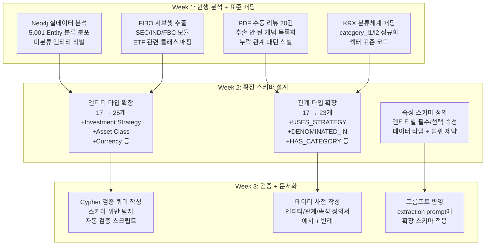

#### 확장 온톨로지 설계안

**추가 엔티티 (+8):**

| 엔티티 | 근거 | 현재 누락으로 인한 문제 |
|-------|------|---------------------|
| **Investment Strategy** | 커버드콜, 액티브, 패시브, 레버리지, 인버스 등이 ETF 속성에 묻힘 | "커버드콜 ETF 목록" 질문 답변 불가 |
| **Asset Class** | Bond/Stock 상위 분류. 주식/채권/원자재/대체투자 | "채권형 ETF" 필터링 실패 (baseline 질문3) |
| **Currency** | 환헤지 분석에 통화 노드 필요 | "환율위험 ETF" 답변 부정확 (baseline 질문4) |
| **Custodian** | Trustee(수탁)와 Custodian(자산보관) 역할 구분 | 혼동 위험 |
| **Category** | KRX 분류 (국내주식/해외주식/채권 등) | 카테고리 기반 필터링 불가 |
| **Distribution** | 분배금 이력을 별도 노드로 | "분배금 지급 ETF" 검색 불가 |
| **Document** | 문서 유형(투자설명서/약관/보고서)을 엔티티로 | 출처 추적 강화 |
| **Rating Agency** | 채권형 ETF의 신용평가사 | 채권 관련 질문 답변 강화 |

**추가 관계 (+6):**

| 관계 | From → To | 근거 |
|-----|----------|------|
| **USES_STRATEGY** | ETF → Investment Strategy | 전략별 ETF 필터링 |
| **HAS_CATEGORY** | ETF → Category | KRX 분류 기반 검색 |
| **DENOMINATED_IN** | ETF → Currency | 투자 통화 명시 |
| **HEDGES_AGAINST** | ETF → Currency | 환헤지 대상 통화 |
| **DISTRIBUTES** | ETF → Distribution | 분배금 이력 연결 |
| **DESCRIBED_IN** | ETF → Document | 문서 출처 연결 |

#### 속성 스키마 예시

```yaml
# ontology/v1.1/entity_schema.yaml
ETF:
  required:
    - name_ko: str          # "TIGER 미국S&P500"
    - ticker: str            # "360750"
    - ksd_fund_code: str     # "KR7360750004"
  optional:
    - name_en: str
    - listing_date: date
    - aum: int               # 단위: 원
    - nav: int               # 단위: 원
    - total_expense_ratio: float  # 단위: %, 범위 0~5
    - currency_hedge: bool

Stock:
  required:
    - name: str              # "Apple" (영문 우선)
  optional:
    - ticker: str            # "AAPL"
    - isin: str              # "US0378331005"
    - market_cap: int

Risk_Factor:
  required:
    - name: str              # "환율위험"
    - risk_type: enum        # market|credit|liquidity|currency|operational
  optional:
    - description: str
    - severity: enum         # high|medium|low
```

---

## 역할 3: LLM Extraction Engineering

### 왜 별도 역할인가

GraphRAG에서 LLM 추출은 전체 파이프라인의 핵심 병목이다.
프롬프트의 품질이 그래프의 품질을 결정하고, 그래프의 품질이 검색 품질을 결정한다.
현재 추출 프롬프트(`indexer.py:40-196`)는 규칙은 상세하나 few-shot 예시가 없어
LLM이 도메인 특화 추출을 제대로 수행하지 못한다.

### 담당 파일

```
src/tiger_etf/graphrag/indexer.py           ← 추출 프롬프트 + 온톨로지
experiments/configs/*.yaml                   ← 모델 설정
experiments/extraction_samples/              ← 신규: 추출 품질 샘플
```

### 작업 상세

```mermaid
flowchart TD
    subgraph "Week 2: 프롬프트 v2"
        X1A[현재 프롬프트 분석<br/>추출 결과 20건 수동 리뷰<br/>누락/오류 패턴 분류]
        X1B[Few-shot 예시 작성<br/>엔티티 유형별 2개씩<br/>관계 유형별 1개씩<br/>총 34+17 = 51개 예시]
        X1C[프롬프트 v2 작성<br/>온톨로지 v1.1 반영<br/>few-shot 포함<br/>명시적 제외 규칙]
    end

    subgraph "Week 3: 모델 비교"
        X2A[5개 모델 추출 실행<br/>동일 10 PDF 대상<br/>Claude 3.7/4/4.5<br/>Haiku 4.5 / Titan]
        X2B[추출 품질 측정<br/>Entity F1 (수동 라벨 대비)<br/>Relation Accuracy<br/>Attribute Coverage]
        X2C[비용-품질 트레이드오프<br/>모델별 토큰 수<br/>추출 시간<br/>CPR 산출]
    end

    subgraph "Week 4: 속성 추출 강화"
        X3A[수치 속성 추출<br/>총보수, NAV, AUM<br/>보유비중, 분배금]
        X3B[카테고리 속성 추출<br/>자산군, 투자전략<br/>투자지역, 섹터]
        X3C[관계 힌트 주입<br/>RDB 데이터를 프롬프트에<br/>사전 지식으로 제공]
    end

    X1A --> X1B --> X1C
    X1C --> X2A --> X2B --> X2C
    X2C --> X3A --> X3B --> X3C
```

#### Few-shot 예시 작성 가이드

현재 프롬프트에는 추출 규칙만 있고 구체적인 예시가 없다.
LLM은 규칙보다 예시에서 더 정확하게 패턴을 학습한다.

```
## Few-shot 예시 (프롬프트에 추가):

### 입력 proposition:
"TIGER 미국S&P500 ETF는 S&P 500 Total Return 지수를 추적합니다."

### 기대 출력:
topic: TIGER 미국S&P500 ETF 지수 추적

  entities:
    TIGER 미국S&P500 ETF|ETF
    S&P 500 Total Return|Index

  proposition: TIGER 미국S&P500 ETF는 S&P 500 Total Return 지수를 추적합니다.

    entity-entity relationships:
    TIGER 미국S&P500 ETF|TRACKS|S&P 500 Total Return

---

### 입력 proposition:
"이 투자신탁의 총보수는 연 0.07%입니다."

### 기대 출력:
  entities:
    총보수 0.07%|Fee

  proposition: 이 투자신탁의 총보수는 연 0.07%입니다.

    entity-attributes:
    TIGER 미국S&P500 ETF|HAS_TOTAL_EXPENSE_RATIO|0.07%

    entity-entity relationships:
    TIGER 미국S&P500 ETF|HAS_FEE|총보수 0.07%

---

### 입력 proposition:
"이 투자신탁은 환율 변동에 따른 위험에 노출될 수 있습니다."

### 기대 출력:
  entities:
    환율위험|Risk Factor

  proposition: 이 투자신탁은 환율 변동에 따른 위험에 노출될 수 있습니다.

    entity-entity relationships:
    TIGER 미국S&P500 ETF|HAS_RISK|환율위험
```

#### 추출 품질 측정 방법

| 메트릭 | 측정 방법 | 목표 |
|-------|---------|-----|
| Entity Precision | 추출된 엔티티 중 정답인 비율 | >0.85 |
| Entity Recall | 정답 엔티티 중 추출된 비율 | >0.70 |
| Relation Accuracy | 추출된 관계 100개 샘플 중 정확한 비율 | >0.80 |
| Attribute Coverage | RDB에 있는 속성 중 그래프에 반영된 비율 | >0.60 |

**Gold Standard 생성**: 10개 PDF에서 수동으로 엔티티/관계 라벨링 (역할 7과 협업)

---

## 역할 4: Entity Resolution & Graph Quality

### 왜 별도 역할인가

LLM 추출은 문서 단위로 수행되므로, 같은 엔티티가 문서마다 다른 이름으로 추출된다.
이를 해소하지 않으면 그래프가 단절되어 multi-hop 질문에 답변할 수 없다.
현재 시스템에는 Entity Resolution이 전혀 없다.

**예시 — 같은 엔티티가 다른 이름으로 존재:**
```
문서 A: "미래에셋TIGER미국S&P500증권상장지수투자신탁(주식)"
문서 B: "TIGER 미국S&P500 ETF"
문서 C: "TIGER 미국S&P500"
RDB:    "TIGER 미국S&P500"  (ticker: 360750)
```
→ 이들이 병합되지 않으면 각각 별도 노드로 존재하여 관계가 단절됨.

### 담당 파일

```
src/tiger_etf/graphrag/entity_resolution.py  ← 신규
src/tiger_etf/graphrag/graph_validator.py    ← 신규
```

### 작업 상세

```mermaid
flowchart TD
    subgraph "Week 3: 중복 탐지"
        ER1[규칙 기반 매칭<br/>- 정확 매칭 (이름 정규화 후)<br/>- 패턴 매칭 (TIGER + 상품명)]
        ER2[유사도 기반 매칭<br/>- Jaro-Winkler > 0.85<br/>- 임베딩 코사인 > 0.90]
        ER3[RDB 기반 매칭<br/>- ksd_fund_code 기준<br/>- ticker 기준 정합]
    end

    subgraph "Week 4: 병합 + 검증"
        ER4[별칭 테이블 구축<br/>- canonical_name 정의<br/>- alias → canonical 매핑]
        ER5[Neo4j 노드 병합<br/>- MERGE 쿼리 실행<br/>- 관계 재연결]
        ER6[그래프 검증<br/>- 고립 노드 탐지<br/>- 관계 방향 검증<br/>- 카디널리티 체크]
    end

    subgraph "Week 5: 자동화"
        ER7[ER 파이프라인 자동화<br/>- 인덱싱 후 자동 실행<br/>- 병합 리포트 생성]
    end

    ER1 --> ER4
    ER2 --> ER4
    ER3 --> ER5
    ER4 --> ER5 --> ER6 --> ER7
```

#### Entity Resolution 파이프라인 설계

```python
# entity_resolution.py (신규)

class EntityResolver:
    """3단계 Entity Resolution 파이프라인."""

    def __init__(self, neo4j_driver, rdb_session):
        self.driver = neo4j_driver
        self.rdb = rdb_session
        self.alias_table: dict[str, str] = {}  # alias → canonical

    def resolve(self):
        """전체 ER 파이프라인 실행."""
        # Phase 1: RDB 기반 확정 매칭 (높은 신뢰도)
        self._match_by_rdb()

        # Phase 2: 규칙 기반 정규화
        self._match_by_rules()

        # Phase 3: 유사도 기반 후보 탐색 (수동 확인 필요)
        candidates = self._match_by_similarity()

        # Phase 4: Neo4j 노드 병합
        self._merge_nodes()

        return self.get_report()

    def _match_by_rdb(self):
        """RDB의 name_ko를 canonical name으로 사용."""
        products = self.rdb.query(EtfProduct).all()
        for p in products:
            # 공식 이름을 canonical로 등록
            canonical = f"TIGER {p.name_ko.replace('TIGER ', '')}"
            # 정규 이름에서 파생 가능한 변형 등록
            self.alias_table[p.name_ko] = canonical
            self.alias_table[canonical] = canonical
            # 정식 명칭 (투자설명서용 긴 이름) 도 별칭으로
            # 예: "미래에셋TIGER미국S&P500증권상장지수투자신탁(주식)"
            ...

    def _match_by_rules(self):
        """한국어 금융 용어 정규화 규칙."""
        NORMALIZATION_RULES = {
            r"증권상장지수투자신탁.*$": "",       # 긴 정식명 → 짧은 이름
            r"^미래에셋": "",                     # 브랜드 접두사 제거
            r"\(주식\)|\(채권.*\)|\(합성\)": "",  # 펀드 유형 접미사 제거
            r"\s+": " ",                          # 공백 정규화
        }
        ...

    def _match_by_similarity(self) -> list[tuple[str, str, float]]:
        """Jaro-Winkler 유사도 기반 후보 쌍 탐색."""
        ...
```

#### 그래프 검증 자동화

```python
# graph_validator.py (신규)
VALIDATION_QUERIES = {
    "orphan_entities": """
        MATCH (e:__Entity__)
        WHERE NOT (e)--()
        RETURN e.name, e.classification
        LIMIT 100
    """,
    "reversed_manages": """
        MATCH (etf:__Entity__ {classification:'ETF'})-[:MANAGES]->(amc)
        RETURN etf.name, amc.name
    """,
    "missing_tracks": """
        MATCH (etf:__Entity__ {classification:'ETF'})
        WHERE NOT (etf)-[:TRACKS]->(:__Entity__ {classification:'Index'})
        RETURN etf.name
    """,
    "duplicate_candidates": """
        MATCH (e1:__Entity__), (e2:__Entity__)
        WHERE id(e1) < id(e2)
          AND e1.classification = e2.classification
          AND apoc.text.jaroWinklerDistance(e1.name, e2.name) > 0.85
        RETURN e1.name, e2.name,
               apoc.text.jaroWinklerDistance(e1.name, e2.name) AS sim
        ORDER BY sim DESC LIMIT 50
    """,
}
```

---

## 역할 5: Retrieval Engineering

### 왜 별도 역할인가

현재 시스템은 Graph Traversal 검색만 사용한다(`query.py:33`).
이는 정확한 엔티티 매칭이 전제되어야 작동하는데, 자연어 질문은 엔티티명과 정확히
일치하지 않는다. **Vector Semantic Search**와 **RDB Parametric Query**를 병행하는
Hybrid Retrieval이 GraphRAG 시스템의 핵심 차별점이다.

### 담당 파일

```
src/tiger_etf/graphrag/query.py              ← 핵심 수정 대상
src/tiger_etf/graphrag/retrieval.py          ← 신규: Hybrid Retrieval
src/tiger_etf/graphrag/rdb_query.py          ← 신규: RDB 직접 쿼리
```

### 작업 상세

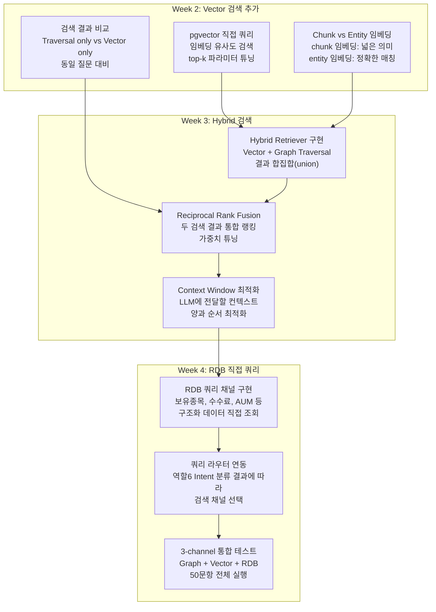

#### Hybrid Retrieval 아키텍처

```
질문 입력
  ↓
┌─────────────────────────────────────────┐
│              Query Router               │
│  (역할 6의 Intent Classifier 결과 활용)   │
├────────────┬──────────────┬─────────────┤
│ STRUCTURED │   SEMANTIC   │    GRAPH    │
│ (수치/필터) │  (서술형)     │ (관계 추론)  │
├────────────┼──────────────┼─────────────┤
│  RDB SQL   │ pgvector ANN │ Neo4j       │
│  Query     │ Search       │ Traversal   │
├────────────┴──────────────┴─────────────┤
│         Reciprocal Rank Fusion          │
│    (가중치: graph=0.4, vec=0.4, rdb=0.2) │
├─────────────────────────────────────────┤
│         Context Assembly                │
│    (top-k 결과 → LLM prompt 구성)       │
└─────────────────────────────────────────┘
  ↓
LLM Response Generation
```

#### RDB 직접 쿼리 채널

```python
# rdb_query.py (신규)
"""구조화된 질문에 대해 RDB를 직접 쿼리하는 채널."""

QUERY_TEMPLATES = {
    "holdings": """
        SELECT h.holding_name, h.weight_pct, h.holding_ticker
        FROM tiger_etf.etf_holdings h
        JOIN tiger_etf.etf_products p ON h.ksd_fund_code = p.ksd_fund_code
        WHERE p.name_ko LIKE :product_name
        ORDER BY h.weight_pct DESC
        LIMIT 20
    """,
    "fee_comparison": """
        SELECT name_ko, ticker, total_expense_ratio
        FROM tiger_etf.etf_products
        WHERE category_l1 = :category
        ORDER BY total_expense_ratio ASC
    """,
    "category_filter": """
        SELECT name_ko, ticker, benchmark_index, total_expense_ratio
        FROM tiger_etf.etf_products
        WHERE category_l1 = :category
        ORDER BY aum DESC
    """,
    "aum_ranking": """
        SELECT name_ko, ticker, aum
        FROM tiger_etf.etf_products
        ORDER BY aum DESC
        LIMIT :top_k
    """,
}

def execute_rdb_query(query_type: str, params: dict) -> list[dict]:
    """RDB 쿼리 실행 후 결과를 LLM 컨텍스트 형식으로 변환."""
    ...
```

---

## 역할 6: Query Understanding & Response Generation

### 왜 별도 역할인가

"어떤 질문이 들어오면 어떤 검색 채널을 쓸 것인가"를 결정하는 것이
GraphRAG의 응답 품질을 좌우한다. 현재는 모든 질문을 동일한 traversal 검색으로 처리하여,
"보유종목 비중" 같은 구조화 질문과 "투자위험" 같은 서술형 질문을 구분하지 못한다.

### 담당 파일

```
src/tiger_etf/graphrag/intent.py             ← 신규: Intent 분류
src/tiger_etf/graphrag/query_rewriter.py     ← 신규: 쿼리 재작성
src/tiger_etf/graphrag/response.py           ← 신규: 응답 생성 프롬프트
```

### 작업 상세

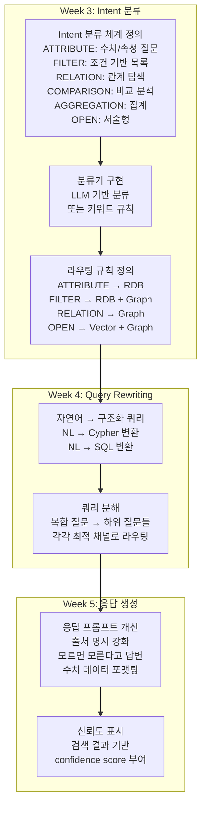

#### Intent 분류 체계

| Intent | 설명 | 예시 질문 | 검색 채널 |
|--------|------|---------|---------|
| **ATTRIBUTE** | 특정 상품의 수치/속성 조회 | "S&P500 ETF의 총보수는?" | RDB 우선 |
| **FILTER** | 조건 기반 상품 목록 | "채권형 ETF는?" | RDB + Graph |
| **RELATION** | 엔티티 간 관계 탐색 | "수탁회사는 어디?" | Graph 우선 |
| **MULTI_HOP** | 2-3 단계 관계 추론 | "S&P500 ETF 보유종목의 섹터?" | Graph 필수 |
| **COMPARISON** | 복수 엔티티 비교 | "S&P500 vs 배당다우존스 차이?" | Graph + RDB |
| **AGGREGATION** | 집계/통계 | "섹터별 ETF 수?" | RDB 우선 |
| **OPEN** | 서술형/의견 | "투자위험은?" | Vector + Graph |
| **NEGATIVE** | 없는 정보 요청 | "비트코인 ETF?" | 전체 검색 후 부재 확인 |

#### 쿼리 분해 예시

```
입력: "미래에셋자산운용이 운용하는 ETF 중 S&P 500 지수를 추적하는 상품의 주요 보유종목은?"

분해 결과:
  Sub-Q1: "미래에셋자산운용이 운용하는 ETF 목록" → FILTER (Graph: MANAGES)
  Sub-Q2: "그 중 S&P 500 지수를 추적하는 것" → FILTER (Graph: TRACKS)
  Sub-Q3: "해당 상품의 주요 보유종목" → ATTRIBUTE (RDB: etf_holdings)

실행:
  1. Graph: (미래에셋자산운용)-[MANAGES]->(ETF)-[TRACKS]->(S&P 500)
  2. 결과 ETF의 ksd_fund_code 추출
  3. RDB: SELECT * FROM etf_holdings WHERE ksd_fund_code = ? ORDER BY weight_pct DESC
  4. 결과 조합하여 LLM에 전달
```

---

## 역할 7: Evaluation & Experiment Management

### 왜 별도 역할인가

다른 모든 역할의 작업이 "실제로 효과가 있었는지"를 판단하는 유일한 수단.
평가 없이는 어떤 변경이 개선인지 퇴보인지 알 수 없다.
Ground Truth 구축은 도메인 지식이 필요하므로 전담 인력이 필수.

### 담당 파일

```
experiments/eval_questions.yaml              ← 50문항 질문셋
experiments/ground_truth.yaml                ← 신규: 정답 데이터
experiments/EVALUATION_METHODOLOGY.md        ← 평가 방법론
src/tiger_etf/graphrag/experiment.py         ← 실험 프레임워크
src/tiger_etf/graphrag/ragas_eval.py         ← 신규: RAGAS 파이프라인
```

### 작업 상세

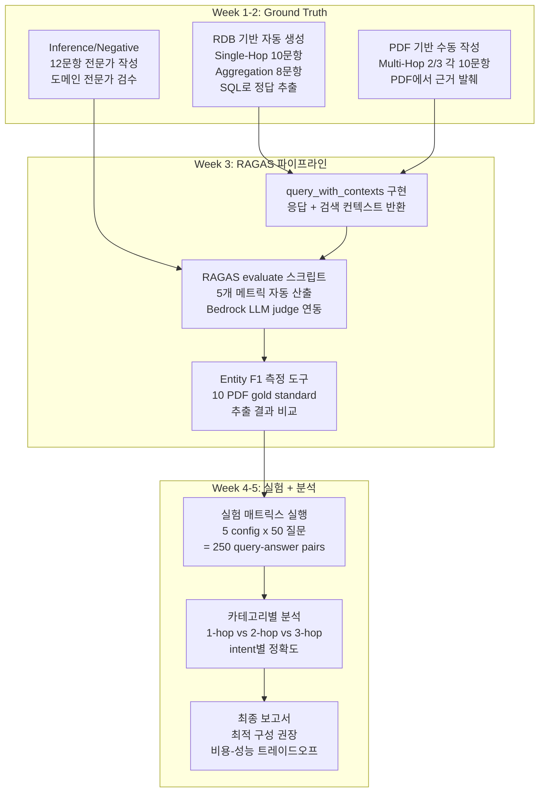

#### RAGAS 파이프라인 구현

```python
# ragas_eval.py (신규)
"""RAGAS 기반 GraphRAG 자동 평가 파이프라인."""

import yaml
from datasets import Dataset
from ragas import evaluate
from ragas.metrics import (
    faithfulness,
    answer_relevancy,
    context_precision,
    context_recall,
    answer_correctness,
)

def load_eval_dataset(questions_path: str, ground_truth_path: str) -> dict:
    """질문셋 + ground truth + 시스템 응답을 RAGAS 형식으로 구성."""
    with open(questions_path) as f:
        questions = yaml.safe_load(f)
    with open(ground_truth_path) as f:
        ground_truths = yaml.safe_load(f)

    eval_data = {
        "question": [],
        "answer": [],
        "contexts": [],
        "ground_truth": [],
        "category": [],    # 추가: 카테고리별 분석용
        "hop_count": [],   # 추가: hop 수별 분석용
    }

    for category, items in questions.items():
        for item in items:
            q_id = item["id"]
            response, contexts = query_with_contexts(item["query"])

            eval_data["question"].append(item["query"])
            eval_data["answer"].append(response)
            eval_data["contexts"].append(contexts)
            eval_data["ground_truth"].append(ground_truths[q_id])
            eval_data["category"].append(category)
            eval_data["hop_count"].append(
                3 if "multi_hop_3" in category
                else 2 if "multi_hop_2" in category
                else 1
            )

    return eval_data

def run_ragas_evaluation(eval_data: dict, experiment_name: str) -> dict:
    """RAGAS 메트릭 산출 + 카테고리별 분석."""
    dataset = Dataset.from_dict(eval_data)

    results = evaluate(
        dataset,
        metrics=[
            faithfulness,
            answer_relevancy,
            context_precision,
            context_recall,
            answer_correctness,
        ],
    )

    # 카테고리별 집계
    category_scores = {}
    for cat in set(eval_data["category"]):
        mask = [c == cat for c in eval_data["category"]]
        cat_results = results.to_pandas()[mask]
        category_scores[cat] = {
            "faithfulness": cat_results["faithfulness"].mean(),
            "answer_relevancy": cat_results["answer_relevancy"].mean(),
            "context_precision": cat_results["context_precision"].mean(),
            "context_recall": cat_results["context_recall"].mean(),
            "answer_correctness": cat_results["answer_correctness"].mean(),
            "count": int(sum(mask)),
        }

    return {
        "overall": results,
        "by_category": category_scores,
        "experiment": experiment_name,
    }
```

#### 실험 결과 비교 표 (목표)

| 메트릭 | baseline | +prompt v2 | +ER | +hybrid | +intent |
|-------|----------|-----------|-----|---------|---------|
| Faithfulness | ? | ? | ? | ? | ? |
| Answer Correctness | ~0.20 | ? | ? | ? | >0.80 |
| Context Recall | ? | ? | ? | ? | ? |
| 1-hop 정확도 | ? | ? | ? | ? | ? |
| 2-hop 정확도 | ? | ? | ? | ? | ? |
| 3-hop 정확도 | ? | ? | ? | ? | ? |
| Avg Latency | 11.95s | ? | ? | ? | <3s |

---

## 역할 8: Infrastructure & Observability

### 왜 별도 역할인가

7개 역할이 동시에 작업하려면 안정적인 인프라가 전제. Neo4j, pgvector, PostgreSQL이
동시 접근 시 충돌하지 않아야 하고, 실험 결과를 추적할 수 있어야 한다.
또한 LLM API 비용이 실험마다 누적되므로 비용 가시성이 필수.

### 담당 파일

```
docker/graphrag/docker-compose.yml           ← 컨테이너 관리
src/tiger_etf/config.py                      ← 환경 설정
src/tiger_etf/graphrag/cost_tracker.py       ← 신규: 비용 추적
src/tiger_etf/graphrag/monitoring.py         ← 신규: 메트릭 수집
```

### 작업 상세

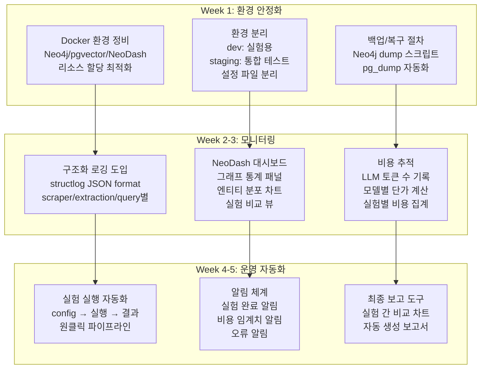

#### 비용 추적 구현

```python
# cost_tracker.py (신규)
BEDROCK_PRICING_PER_1M_TOKENS = {
    "us.anthropic.claude-3-7-sonnet-20250219-v1:0": {"input": 3.00, "output": 15.00},
    "us.anthropic.claude-sonnet-4-5-20250514-v1:0":  {"input": 3.00, "output": 15.00},
    "us.anthropic.claude-sonnet-4-20250514-v1:0":    {"input": 3.00, "output": 15.00},
    "us.anthropic.claude-haiku-4-5-20250514-v1:0":   {"input": 0.80, "output": 4.00},
}

EMBEDDING_PRICING = {
    "cohere.embed-multilingual-v3": 0.10,   # per 1M tokens
    "amazon.titan-embed-text-v2:0": 0.02,   # per 1M tokens
}

class ExperimentCostTracker:
    def __init__(self, experiment_name: str, model_id: str, embedding_id: str):
        self.experiment_name = experiment_name
        self.model_id = model_id
        self.embedding_id = embedding_id
        self.extraction_input_tokens = 0
        self.extraction_output_tokens = 0
        self.query_input_tokens = 0
        self.query_output_tokens = 0
        self.embedding_tokens = 0

    @property
    def extraction_cost(self) -> float:
        p = BEDROCK_PRICING_PER_1M_TOKENS.get(self.model_id, {})
        return (
            self.extraction_input_tokens * p.get("input", 0)
            + self.extraction_output_tokens * p.get("output", 0)
        ) / 1_000_000

    @property
    def query_cost(self) -> float:
        p = BEDROCK_PRICING_PER_1M_TOKENS.get(self.model_id, {})
        return (
            self.query_input_tokens * p.get("input", 0)
            + self.query_output_tokens * p.get("output", 0)
        ) / 1_000_000

    @property
    def embedding_cost(self) -> float:
        p = EMBEDDING_PRICING.get(self.embedding_id, 0)
        return self.embedding_tokens * p / 1_000_000

    @property
    def total_cost(self) -> float:
        return self.extraction_cost + self.query_cost + self.embedding_cost

    def summary(self) -> dict:
        return {
            "experiment": self.experiment_name,
            "extraction_cost_usd": round(self.extraction_cost, 4),
            "query_cost_usd": round(self.query_cost, 4),
            "embedding_cost_usd": round(self.embedding_cost, 4),
            "total_cost_usd": round(self.total_cost, 4),
        }
```

---

## 주차별 마일스톤 & 역할 간 의존성

### Week 1: Foundation (기반 구축)

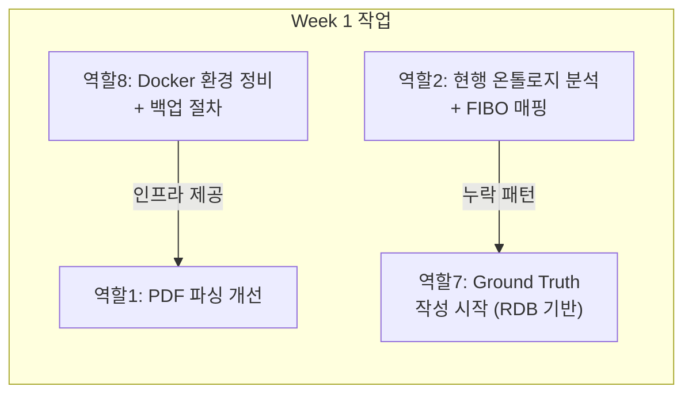

| 역할 | Week 1 산출물 | 완료 기준 |
|-----|-------------|---------|
| 역할 1 | 문서 유형별 파서, 표 파싱 도입 | prospectus 표 데이터 구조화 성공 |
| 역할 2 | 현행 온톨로지 분석 보고서, FIBO 매핑표 | 누락 엔티티/관계 목록 확정 |
| 역할 7 | Single-Hop + Aggregation GT 18문항 | RDB SQL로 정답 검증 가능 |
| 역할 8 | Docker 환경 안정화, 백업 스크립트 | 전 역할이 동시 접근 가능 |

### Week 2: Core Build (핵심 구축)

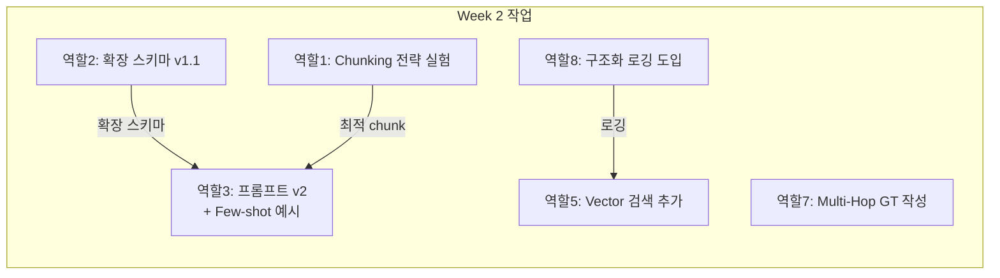

| 역할 | Week 2 산출물 | 완료 기준 |
|-----|-------------|---------|
| 역할 1 | Chunking 실험 보고서 (3x3 매트릭스) | 최적 chunk_size/overlap 선정 |
| 역할 2 | 온톨로지 v1.1 (25 엔티티, 23 관계) | `indexer.py`에 반영 가능 상태 |
| 역할 3 | 추출 프롬프트 v2 (few-shot 51개 포함) | 10 PDF 대상 추출 테스트 통과 |
| 역할 5 | pgvector 직접 검색 + 기존 traversal 비교 | 동일 질문 대비 결과 비교표 |
| 역할 7 | Multi-Hop 2/3 GT 20문항 | PDF 근거 발췌 첨부 |
| 역할 8 | structlog 기반 JSON 로깅 | scraper/extraction/query 로그 수집 |

### Week 3: Integration (통합)

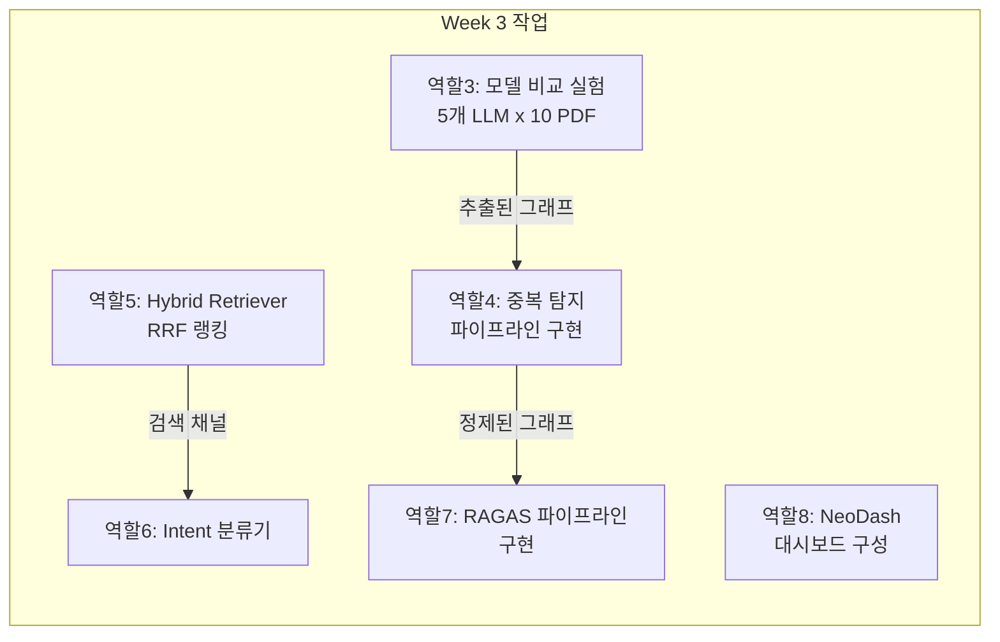

| 역할 | Week 3 산출물 | 완료 기준 |
|-----|-------------|---------|
| 역할 3 | 모델별 Entity F1 비교표 | 최적 extraction LLM 선정 |
| 역할 4 | ER 파이프라인 (규칙 + 유사도 + RDB) | 중복 노드 50% 이상 감소 |
| 역할 5 | Hybrid Retriever (Vector + Graph) | 5문항 대비 검색 품질 향상 확인 |
| 역할 6 | Intent 분류기 (8개 카테고리) | 50문항 중 정확도 >85% |
| 역할 7 | RAGAS 스크립트 + baseline 재측정 | 50문항 전체 RAGAS 점수 산출 |
| 역할 8 | NeoDash 5개 패널 | 그래프 통계 실시간 확인 가능 |

### Week 4: Optimization (최적화)

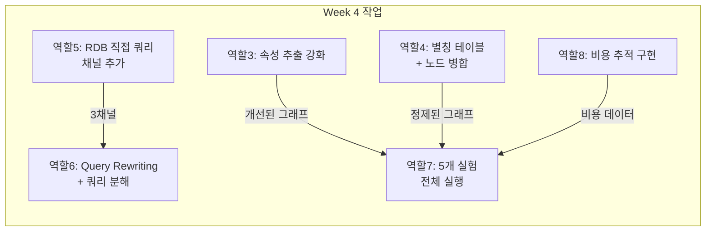

| 역할 | Week 4 산출물 | 완료 기준 |
|-----|-------------|---------|
| 역할 3 | 수치 속성 추출률 >60% | RDB 속성 대비 그래프 커버리지 측정 |
| 역할 4 | 별칭 테이블 + 병합 완료 | 고립 노드 <5% |
| 역할 5 | 3-channel 검색 (Graph + Vector + RDB) | 50문항 전체 실행 성공 |
| 역할 6 | Query Rewriter + 쿼리 분해 | 3-hop 질문 분해 성공 |
| 역할 7 | 5개 실험 x 50문항 RAGAS 결과 | 실험 간 비교표 완성 |
| 역할 8 | 실험별 비용 리포트 | CPR(비용-성능 비율) 산출 |

### Week 5: Final (마무리)

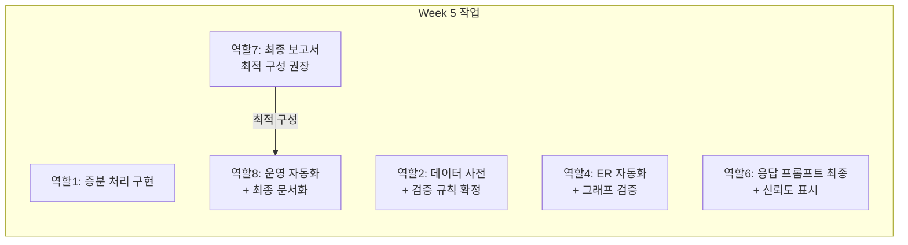

| 역할 | Week 5 산출물 | 완료 기준 |
|-----|-------------|---------|
| 역할 1 | 증분 인덱싱 지원 | 신규 PDF만 처리 성공 |
| 역할 2 | 온톨로지 데이터 사전 + Cypher 검증 쿼리 | 전 팀원 리뷰 완료 |
| 역할 4 | ER 자동화 (인덱싱 후 자동 실행) | 수동 개입 없이 병합 |
| 역할 6 | 응답 생성 최종 버전 | 모르면 모른다고 답변 |
| 역할 7 | 프로젝트 최종 보고서 | 최적 구성 + 비용 + 로드맵 |
| 역할 8 | 운영 매뉴얼 + 원클릭 실행 | 신규 팀원이 즉시 실행 가능 |

---

## 역할 간 핵심 의존성 요약

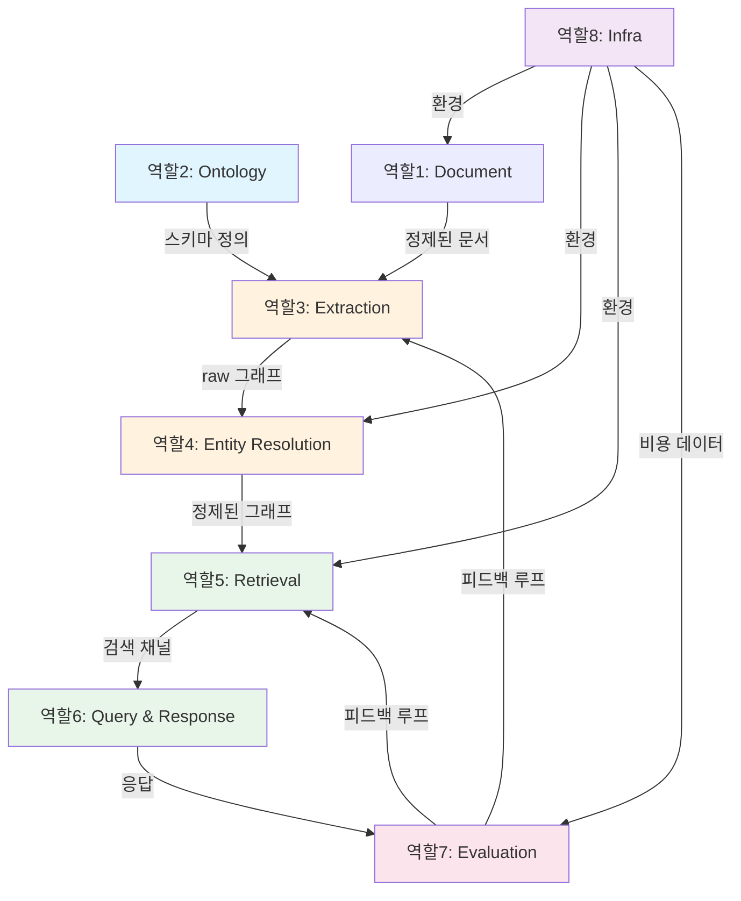

**크리티컬 패스 (병목 경로):**

```
역할2 (온톨로지) → 역할3 (추출) → 역할4 (ER) → 역할5 (검색) → 역할7 (평가)
```

이 경로가 지연되면 전체 프로젝트가 지연됨. 특히:
- **역할 2가 Week 2에 스키마를 확정하지 못하면** 역할 3의 프롬프트 작업이 밀림
- **역할 3이 Week 3에 추출 품질을 개선하지 못하면** 역할 4의 ER이 무의미
- **역할 7은 Week 1부터 GT 작성을 병행**해야 Week 3에 RAGAS를 실행할 수 있음

---

## 팀 구성 권장안

8개 역할을 팀 규모에 따라 병합:

### 4인 팀

| 담당자 | 역할 조합 | 이유 |
|-------|---------|-----|
| A | 역할 1 + 역할 8 | Document + Infra (데이터 엔지니어) |
| B | 역할 2 + 역할 4 | Ontology + ER (지식 모델링) |
| C | 역할 3 + 역할 6 | Extraction + Query (LLM 엔지니어) |
| D | 역할 5 + 역할 7 | Retrieval + Evaluation (검색 엔지니어) |

### 6인 팀

| 담당자 | 역할 | 비고 |
|-------|-----|------|
| A | 역할 1 (Document) | PDF 파싱 전문 |
| B | 역할 2 + 4 (Ontology + ER) | 지식 그래프 품질 전담 |
| C | 역할 3 (Extraction) | LLM 프롬프트 엔지니어 |
| D | 역할 5 + 6 (Retrieval + Query) | 검색 파이프라인 전담 |
| E | 역할 7 (Evaluation) | 평가 + GT 작성 (도메인 지식 필요) |
| F | 역할 8 (Infra) | DevOps + 모니터링 |

### 8인 팀

각 역할에 1명씩 배정. 가장 이상적인 구성.
